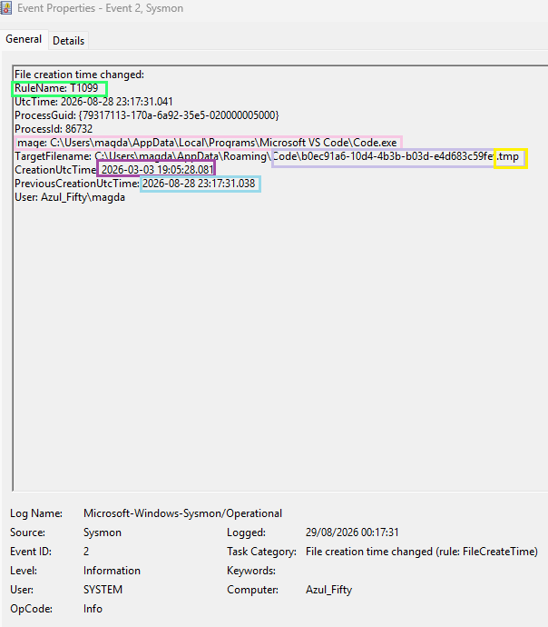

# 🧪 VS Code Timestomping Hands‑On Evidence  
### Sysmon Event ID 2 — File Creation Time Changed

This evidence captures a benign timestomping event generated by **Visual Studio Code (Code.exe)**.  
Although Sysmon flags this behaviour under **MITRE T1099 — Timestomp**, in this case the activity is legitimate and caused by VS Code’s internal handling of temporary files.

---

## 📸 Evidence Screenshot — Highlighted Indicators of Benign Activity

### 🔍 Highlighted Indicators (Why This Event Is Benign)

**🟩 1. Legitimate Process (Code.exe)**  
The executable originates from a trusted developer tool:  
`C:\Users\magda\AppData\Local\Programs\Microsoft VS Code\Code.exe`  
This is a standard installation path and a signed Microsoft product.

**🟦 2. Temporary File (.tmp) in VS Code Roaming Directory**  
`C:\Users\magda\AppData\Roaming\Code\*.tmp`  
VS Code frequently creates and modifies temporary files for autosave, workspace state, and extension metadata.  
This location is expected and safe.

**🟨 3. Timestamp Restoration (Event ID 2 Trigger)**  
Creation time changed from:  
`2026‑08‑28 23:17:31.038`  
to:  
`2026‑03‑03 19:05:28.081`  
VS Code restored an older timestamp from cached session data — benign behaviour that resembles timestomping but is not malicious.

**🟩 4. User Context (Interactive Session)**  
`User: Azul_Fifty\magda`  
The process runs under your normal user account, not SYSTEM or service accounts.  
No privilege escalation or suspicious impersonation.

**⬜ 5. Clean Command Line**  
No unusual parameters, no script execution, no DLL injection flags.  
This is standard VS Code runtime behaviour.

---

## 🔹 Event Summary

A Sysmon **Event ID 2** was triggered when VS Code modified the creation timestamp of a temporary file located under:

`%AppData%\Roaming\Code\`

This behaviour is normal for applications that manage:

- autosave  
- workspace state  
- extension metadata  
- cached editor sessions  
- temporary buffers  

VS Code frequently rewrites `.tmp` files and may restore older timestamps depending on how the editor reconstructs session data.

---

## 🔹 Evidence Extract (Sysmon Event ID 2)

**Process:**  
`C:\Users\magda\AppData\Local\Programs\Microsoft VS Code\Code.exe`

**Target file:**  
`C:\Users\magda\AppData\Roaming\Code\b0ec91a6-10d4-4b3b-b03d-e4d683c59fef.tmp`

**Timestamp change:**  
- **PreviousCreationUtcTime:** 2026‑08‑28 23:17:31.038  
- **CreationUtcTime:** 2026‑03‑03 19:05:28.081  

This indicates VS Code reapplied an older timestamp to a temporary file — a behaviour that resembles timestomping but is benign.

---

## 🔹 Why This Happens (Benign Explanation)

VS Code uses temporary files to store:

- editor state  
- extension data  
- undo/redo buffers  
- workspace metadata  
- cached configuration  

When restoring or updating these files, VS Code may:

- recreate them  
- overwrite them  
- restore previous metadata  
- sync timestamps with cached versions  

This can produce **Event ID 2** even though no malicious timestomping is occurring.

---

## 🔹 SOC Triage Assessment

### ✔ Indicators of benign activity

- Process is **Code.exe**, a trusted developer tool  
- File is a `.tmp` file in VS Code’s roaming profile directory  
- No suspicious command line  
- No privilege escalation  
- No correlation with:
  - CreateRemoteThread  
  - ProcessAccess to sensitive processes  
  - unsigned DLL loads  
  - abnormal network activity  

### ✔ No signs of anti‑forensics  
The timestamp change is part of VS Code’s normal caching behaviour.

---

## 🔹 MITRE ATT&CK Mapping

Although Sysmon labels this under **T1099 — Timestomp**, this instance is:

- benign  
- non‑malicious  
- application‑driven timestamp restoration

This evidence is useful for understanding false positives related to timestomping.

---

## 🔹 Analyst Notes

This case demonstrates how developer tools can generate telemetry that resembles anti‑forensic behaviour.  
Understanding these patterns helps reduce false positives and improves detection accuracy for real timestomping attempts.

---

### **Authored by**  
**Magda Dominguez**  
Security Operations • Detection Engineering • Blue Team

---