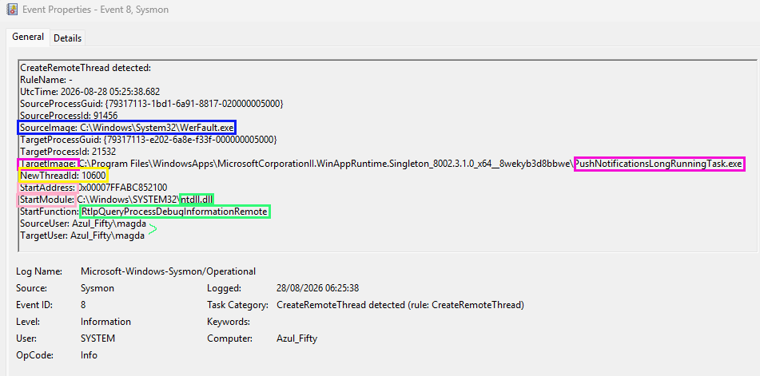

# Evidence: Sysmon Event ID 8 (CreateRemoteThread)

**Legitimate Debugging Injection by WerFault.exe into WinAppRuntime Push Notification Service**

---

## Summary
A Sysmon Event ID 8 was captured during hands-on Sysmon logging exercises. The event shows `WerFault.exe` (Windows Error Reporting) creating a remote thread inside a Windows App Runtime Push Notification service. Although `CreateRemoteThread` is strongly associated with malicious process injection techniques (MITRE T1055.001), this case is a legitimate debugging operation performed by Windows when an application encounters an error.

This evidence is valuable for SOC analysis because it demonstrates how benign system behaviour can mimic high-risk attacker techniques, reinforcing the importance of contextual analysis and process lineage validation.

---

## Event: WerFault.exe Remote Thread Injection (Legitimate Debugging Behaviour)

### Log Artefact

| Field | Value |
| :--- | :--- |
| **Event ID** | 8 |
| **Event Type** | CreateRemoteThread |
| **Timestamp** | 2026-08-28 05:25:38.682 |
| **Source Process** | `C:\Windows\System32\WerFault.exe` |
| **Source PID** | 91456 |
| **Target Process** | `PushNotificationsLongRunningTask.exe` |
| **Target PID** | 21532 |
| **StartModule** | `C:\Windows\SYSTEM32\ntdll.dll` |
| **StartFunction** | `RtlpQueryProcessDebugInformationRemote` |
| **NewThreadId** | 10600 |
| **SourceUser** | `Azul_Fifty\magda` |
| **TargetUser** | `Azul_Fifty\magda` |

---
---

## Interpretation
This event shows `WerFault.exe` injecting a remote thread into a Windows App Runtime process responsible for push notifications. The injected thread begins execution inside `ntdll.dll` at the function:

`RtlpQueryProcessDebugInformationRemote`

This function is used by Windows to:
* Collect debugging information
* Inspect the state of a crashed or unstable process
* Generate diagnostic reports

Although `CreateRemoteThread` is commonly associated with malicious activity such as:
* DLL injection
* Process hollowing
* Code execution inside another process
* Credential theft

In this case, the behaviour is legitimate and expected. `WerFault` routinely uses `CreateRemoteThread` to gather crash data from processes running under the same user context.

**Key indicators of legitimacy:**
* Both processes run under the same user (`Azul_Fifty\magda`)
* The `StartFunction` belongs to `ntdll.dll` and is a known debugging routine
* The target process is a Windows App Runtime component
* No suspicious modules, payloads, or anomalous memory addresses are involved

---

## MITRE ATT&CK Mapping
Although benign, the technique corresponds to:
* **T1055** — Process Injection
* **T1055.001** — Thread Execution / CreateRemoteThread

This reinforces the importance of distinguishing legitimate system debugging from malicious injection.

---

## Main Takeaways
This Sysmon Event ID 8 highlights several important aspects of process-injection telemetry:

* **CreateRemoteThread is not always malicious:** Windows Error Reporting uses the same mechanism attackers use, making context essential.
* **StartFunction analysis is critical:** `RtlpQueryProcessDebugInformationRemote` is a strong indicator of legitimate debugging behaviour.
* **User context matters:** Both processes run under the same user, reducing the likelihood of privilege-escalation-based injection.
* **Benign system noise can resemble attacker tradecraft:** SOC analysts must validate process lineage, module origin, and function purpose before escalating.
* **High-value evidence for detection engineering:** This event can be used to refine detection logic (exclusion filters/tuning) that distinguishes legitimate debugging from suspicious injection patterns.
---
---