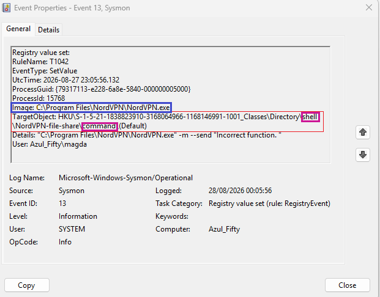
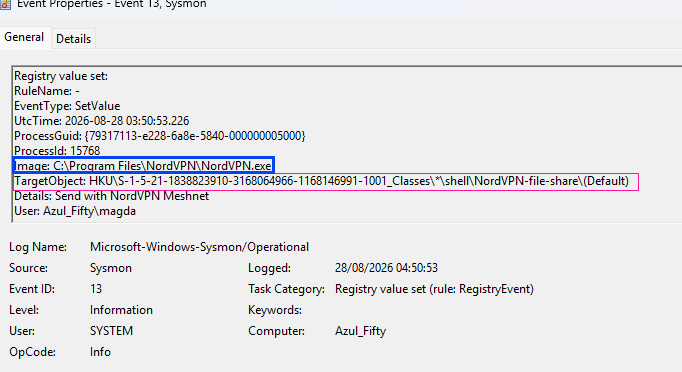
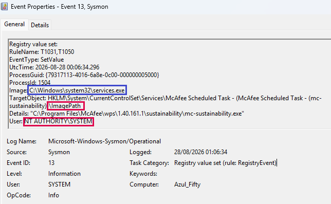
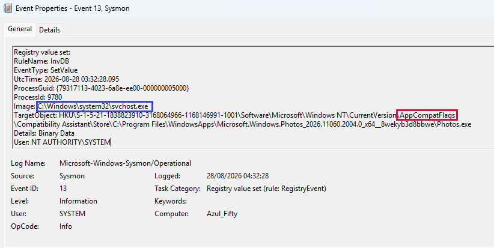

# Evidence : Sysmon Event ID 13 (Registry Value Set)
### **Combined Multi‑Event Analysis: Shell Extensions, Service Modification & AppCompatFlags**

**Summary**

Four Sysmon Event ID 13 events were observed during practical Sysmon logging exercises. Although all four originate from legitimate software (NordVPN, McAfee, Windows Photos), they demonstrate three distinct categories of registry modification:

* Shell extensions (NordVPN)
* Service configuration changes (McAfee)
* AppCompatFlags compatibility metadata (`svchost.exe`)

These artefacts are extremely valuable for SOC analysis because they closely resemble attacker techniques such as persistence, service hijacking, execution via shell extensions, and registry‑based evasion. This combined evidence shows how benign activity can mimic malicious behaviour.

---

### Event 1: **NordVPN Shell Command Extension (Directory Context Menu)**

**Log Artefact**

| Field | Value |
| :--- | :--- |
| **Event ID** | `13` |
| **Event Type** | `SetValue` |
| **Timestamp** | `2026-08-27 23:05:56.132` |
| **Process** | `C:\Program Files\NordVPN\NordVPN.exe` |
| **Registry Key** | `HKU\...\Directory\shell\NordVPN-file-share\command\(Default)` |
| **New Value** | `"C:\Program Files\NordVPN\NordVPN.exe" -m --send "Incorrect function."` |
| **User** | `Azul_Fifty\magda` |

**Interpretation**

This modification adds a right‑click command to the Windows Explorer directory context menu. Malware frequently abuses identical registry paths to:

* Execute payloads via context menus
* Establish persistence
* Trigger malicious scripts on user interaction

Although legitimate, the pattern is identical to malicious shell extension techniques.

---

### Event 2 : **NordVPN Meshnet Shell Extension (File Context Menu)**

**Log Artefact**

| Field | Value |
| :--- | :--- |
| **Event ID** | `13` |
| **Event Type** | `SetValue` |
| **Timestamp** | `2026-08-28 03:50:53.226` |
| **Process** | `C:\Program Files\NordVPN\NordVPN.exe` |
| **Registry Key** | `HKU\...\*\shell\NordVPN-file-share\(Default)` |
| **New Value** | `Send with NordVPN Meshnet` |
| **User** | `Azul_Fifty\magda` |

**Interpretation**

This entry adds a file‑level context‑menu option. The `*\shell\...` path is commonly abused by malware to:

* Execute payloads when users open or right‑click files
* Hide malicious commands behind legitimate UI elements
* Persist through Explorer interactions

Legitimate activity, but highly relevant for SOC practice due to its similarity to attacker techniques.

---

### Event 3 : **McAfee Service ImagePath Modification (SYSTEM‑Level Service Change)**

**Log Artefact**

| Field | Value |
| :--- | :--- |
| **Event ID** | `13` |
| **Event Type** | `SetValue` |
| **Timestamp** | `2026-08-28 00:06:34.296` |
| **Process** | `C:\Windows\system32\services.exe` |
| **Registry Key** | `HKLM\System\CurrentControlSet\Services\McAfee Scheduled Task - (mc-sustainability)\ImagePath` |
| **New Value** | `"C:\Program Files\McAfee\wps\1.40.161.1\sustainability\mc-sustainability.exe"` |
| **User** | `NT AUTHORITY\SYSTEM` |
| **RuleName** | `T1031, T1050` |

**Interpretation**

This is high‑value evidence. Modifying `ImagePath` under `HKLM\System\CurrentControlSet\Services\...` is a recognised attacker technique:

* **T1031:** Modify Existing Service
* **T1050:** New Service

Attackers use this to:

* Replace legitimate service executables
* Gain persistence
* Escalate privileges
* Execute malware as SYSTEM

Although McAfee is legitimate, the behaviour is identical to malicious service hijacking.

---

### Event 4 : **AppCompatFlags Modification (svchost.exe - SYSTEM)**

**Log Artefact**

| Field | Value |
| :--- | :--- |
| **Event ID** | `13` |
| **Event Type** | `SetValue` |
| **Timestamp** | `2026-08-28 03:32:28.095` |
| **Process** | `C:\Windows\system32\svchost.exe` |
| **Registry Key** | `HKU\...\Software\Microsoft\Windows NT\CurrentVersion\AppCompatFlags\Compatibility Assistant\Store\C:\Program Files\WindowsApps\Microsoft.Windows.Photos_2026.11060.2004.0_x64__8wekyb3d8bbwe\Photos.exe` |
| **New Value** | `Binary Data` |
| **User** | `NT AUTHORITY\SYSTEM` |
| **RuleName** | `InvDB` |

**Interpretation**

This event shows Windows updating compatibility metadata for a UWP application. The `AppCompatFlags` keys are used to:

* Store compatibility decisions
* Apply execution shims
* Record application failures
* Enforce mitigations
* Track problematic binaries

Attackers sometimes manipulate these keys to:

* Bypass mitigations
* Disable warnings
* Force insecure execution modes
* Hide malicious behaviour

This adds a third category of registry modification to the evidence set.

---

### **MITRE ATT&CK Mapping (Across All Events)**

* **T1112:** Modify Registry
* **T1547:** Persistence via Registry (Shell Extensions)
* **T1031:** Modify Existing Service
* **T1050:** New Service

---
### **Main Takeaways**
These four **Sysmon Event ID 13** entries highlight several important aspects of registry-based activity on Windows systems:

**Registry modifications occurring under both `HKU` (user context) and `HKLM` (system context):**  
This shows how changes can originate from different privilege levels.  
(Glossary: <a href="../../../0.therory/glossary.md#registry-modification-across-hku-and-hklm" target="_blank">HKU vs HKLM</a>↗)

**Clear examples of three distinct registry modification behaviours:**  

Shell extensions added to Explorer context menus  
(Glossary: <a href="../../../0.therory/glossary.md#shell-extensions" target="_blank">Shell Extensions</a>↗)

Service configuration changes via `ImagePath` updates  
(Glossary: <a href="../../../0.therory/glossary.md#service-configuration-changes" target="_blank">Service Configuration Changes</a>↗)

`AppCompatFlags` entries created by the Compatibility Assistant  
(Glossary: <a href="../../../0.therory/glossary.md#appcompatflags" target="_blank">AppCompatFlags</a>↗)

**Legitimate software noise:**  
Legitimate applications can generate registry activity that closely resembles attacker techniques used for persistence, privilege escalation, or evasion.

**Multi-event context:**  
Correlating multiple registry events helps build a clearer understanding of how different processes interact with the registry over time, supporting the development of robust detection logic for suspicious registry activity.

---

