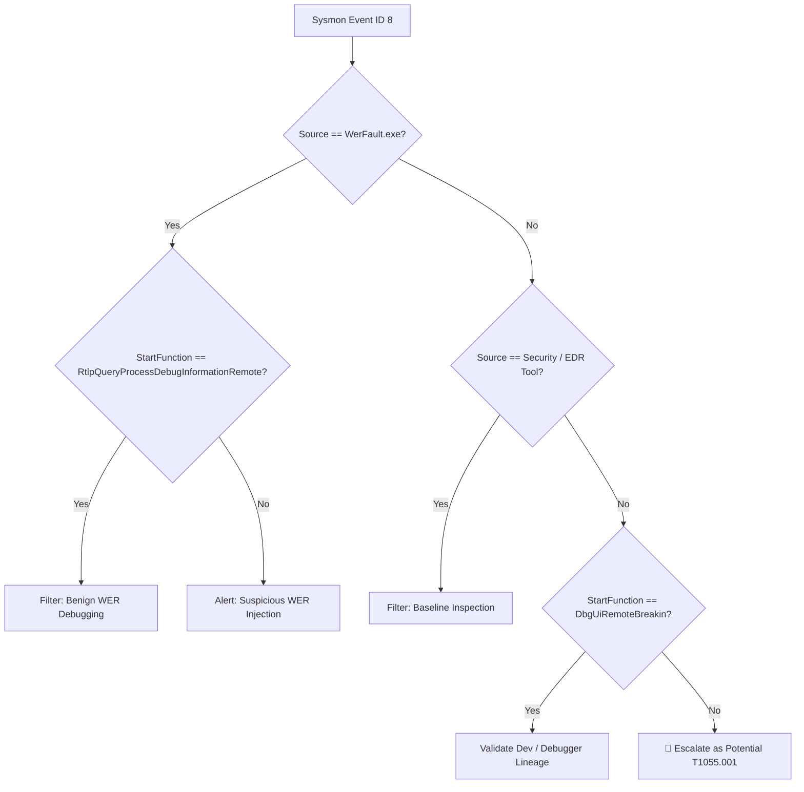

# Detection Opportunities & False Positive Analysis

**Technique:** [T1055.001 — Process Injection: Thread Execution / CreateRemoteThread](https://attack.mitre.org/techniques/T1055/001/)  
**Detection Category:** Process Injection / Defense Evasion  

---

## Detection Opportunities

`CreateRemoteThread` offers high-fidelity detection opportunities because direct cross-process thread injection is relatively rare outside dedicated debugging, diagnostics, or endpoint security tooling. When abused by adversaries, it provides stealthy in-memory execution; when used natively, it mimics attacker tradecraft. 

A robust behavioural detection strategy leverages the following core telemetry pivots:

### 1. High-Value Target Processes
Adversaries frequently inject threads into sensitive or long-running Windows processes to dump credentials, escalate privileges, or evade process-based monitoring.

| Target Process | Adversary Objective | Common Threat Context |
| :--- | :--- | :--- |
| `lsass.exe` | Credential Theft | Dumping LSASS memory via Mimikatz, Dumpert, Cobalt Strike. |
| `winlogon.exe` | Privilege Escalation / Persistence | Hijacking high-integrity interactive logon processes. |
| `svchost.exe` | Defense Evasion | Masking C2 beacons and malicious network connections. |
| `explorer.exe` | Persistence / Evasion | Maintaining interactive sessions within user desktop space. |
| `services.exe` | SYSTEM Execution | Gaining unrestricted host control via service controller injection. |

> **Analyst Pivot:** Any `CreateRemoteThread` call targeting critical binaries like `lsass.exe` from an unverified or non-security source warrants immediate triage.

### 2. Suspicious `StartFunction` Analysis
The entry-point function (`StartFunction`) is one of the most reliable indicators to differentiate benign system routines from payload execution:

* **Legitimate Debugging Routines:**
  * `RtlpQueryProcessDebugInformationRemote` (Windows Error Reporting / WER)
  * `DbgUiRemoteBreakin` (Debuggers / Remote debugging breaks)
* **Suspicious Indicators:**
  * Standard loader exports (e.g., `LoadLibraryA`, `LoadLibraryW`) used in classic DLL injection.
  * Entry points pointing directly to non-standard or unexported memory addresses.
  * Obfuscated function names or routines residing in user-writable space.

### 3. Privilege Escalation & Integrity Mismatches
Examining the execution context between the injector and the target highlights security boundary crossings:

* **User Context Mismatches:** Events where `SourceUser != TargetUser` (e.g., a standard user injecting into a service account or `NT AUTHORITY\SYSTEM`).
* **Integrity Level Divergence:** Lower-integrity processes spawning threads in higher-integrity targets indicate active local privilege escalation attempts.

### 4. Memory Allocation Sequence Correlation
Malicious remote thread creation rarely occurs in isolation. It typically represents the final execution step of a multi-stage injection chain:

$$\text{VirtualAllocEx (Allocate)} \longrightarrow \text{WriteProcessMemory (Write)} \longrightarrow \text{CreateRemoteThread (Execute)}$$

**Cross-Event Correlation:**
* **Sysmon Event ID 10 (ProcessAccess):** Captures high-privilege access masks (`PROCESS_VM_WRITE`, `PROCESS_VM_OPERATION`, `PROCESS_CREATE_THREAD`).
* **Sysmon Event ID 7 (ImageLoad):** Identifies non-standard DLLs loaded into the target immediately after execution.
* **Sysmon Event ID 8 (CreateRemoteThread):** Marks the execution trigger.

### 5. Unsigned or Anomaly-Prone `SourceImage`
Inspect the origin of the source binary initiating the injection:
* Binary lacks a valid digital signature or uses a self-signed certificate.
* Process executes from volatile/writable paths (e.g., `\AppData\`, `C:\Users\Public\`, `C:\PerfLogs\`).
* Binary impersonates legitimate system names (e.g., typosquatting like `svch0st.exe`, `exp1orer.exe`).

### 6. Non-System `StartModule`
The module housing the entry point should strictly map to legitimate operating system libraries:
* **Benign:** Modules located within `C:\Windows\System32\` (predominantly `ntdll.dll` or `kernel32.dll`).
* **Suspicious:** Modules executing out of `%TEMP%`, `%APPDATA%`, or custom working directories.

---

## False Positive Analysis & Tuning

Because Windows native services and security tools leverage `CreateRemoteThread` for legitimate operation, filtering out known-good baselines is essential to prevent alert fatigue.

### 1. Windows Error Reporting (`WerFault.exe` / `wermgr.exe`)
* **Behavior:** Injects threads to query process state and generate crash diagnostics.
* **Tuning Attributes:**
  * `SourceImage` = `C:\Windows\System32\WerFault.exe` or `wermgr.exe`
  * `StartFunction` = `RtlpQueryProcessDebugInformationRemote`
  * `StartModule` = `C:\Windows\System32\ntdll.dll`
  * `SourceUser` == `TargetUser`

### 2. Antivirus & EDR Solutions
* **Behavior:** Endpoint protection agents inject monitoring hooks or trigger inline memory scans.
* **Tuning Attributes:**
  * `SourceImage` resides in protected vendor paths (e.g., `C:\Program Files\Windows Defender\`, `C:\Program Files\<EDR_Vendor>\`).
  * Signatures verified against Microsoft / Vendor certificates.

### 3. Developer Debuggers (Visual Studio, WinDbg)
* **Behavior:** Interactive debugging sessions injecting remote break-in routines.
* **Tuning Attributes:**
  * `SourceImage` matches verified tools (e.g., `vsjitdebugger.exe`, `devenv.exe`, `windbg.exe`).
  * `StartFunction` = `DbgUiRemoteBreakin`

### 4. Windows Telemetry & App Runtime
* **Behavior:** Diagnostic engines collecting runtime state from UWP and WinAppRuntime containers.
* **Tuning Attributes:**
  * `TargetImage` located within `C:\Program Files\WindowsApps\...` or related runtime frameworks.

### 5. Sysinternals & Administrative Diagnostics
* **Behavior:** Deep process state exploration and thread inspection utilities.
* **Tuning Attributes:**
  * `SourceImage` = `procexp.exe`, `procmon.exe` (digitally signed by Microsoft).

---

## Section Summary

* **Detection Core:** Target process criticality, `StartFunction` verification, and user integrity alignment serve as the primary filters for hostile activity.
* **Tuning Rule:** Isolate and allowlist native debugging signatures (`WerFault.exe` + `RtlpQueryProcessDebugInformationRemote`) without broadly suppressing the underlying Event ID 8 telemetry.
---

### **Authored by**
**Magda Dominguez**  
Security Operations • Detection Engineering • Blue Team

---
