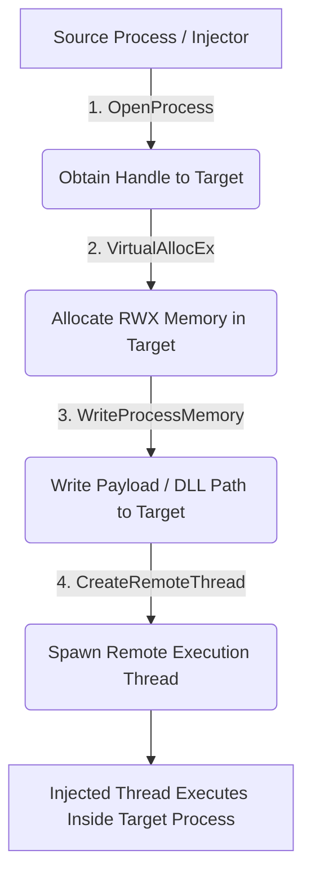

# Threat Background: Process Injection via CreateRemoteThread

**MITRE ATT&CK:** [T1055 — Process Injection](https://attack.mitre.org/techniques/T1055/)  
**Sub-Technique:** [T1055.001 — Process Injection: Dynamic-link Library Injection / Thread Execution](https://attack.mitre.org/techniques/T1055/001/)

---

## 1. Overview

**Process Injection** is a high-risk defense evasion and privilege escalation technique used by adversaries to execute arbitrary code inside the address space of a separate, running process. Running code within the context of a legitimate, trusted process grants attackers several operational advantages:

* **Evasion:** Bypasses basic process-based allowlisting and behavioral detections.
* **Privilege Escalation:** Inherits the target process’s security context and access tokens.
* **Stealth:** Masks malicious network connections and memory reads/writes behind trusted binaries.
* **Memory Access:** Accesses sensitive protected memory (e.g., LSASS).
* **Persistence:** Hides within long-running system processes without creating suspicious standalone binaries on disk.

One of the most common API mechanisms used to achieve this is **`CreateRemoteThread`**. While heavily abused by malware families, offensive frameworks (Cobalt Strike, Metasploit), and red teams, it is also legitimately used by native Windows diagnostic utilities (such as `WerFault.exe`), debuggers, and endpoint security agents. 

Understanding the telemetry generated by `CreateRemoteThread` is fundamental for a SOC Analyst to differentiate benign system maintenance from active adversary tradecraft.

---

## 2. Technical Execution Flow

The classic injection routine leveraging `CreateRemoteThread` follows a defined sequence of Windows API calls:

### Telemetry Mapping

When monitored by Microsoft Sysmon, this activity generates **Event ID 8 (CreateRemoteThread)**, populating critical telemetry fields:

* **`SourceImage`**: The process initiating the injection (injector).
* **`TargetImage`**: The process receiving the thread (injected).
* **`StartModule`**: The PE module where the newly spawned thread begins execution.
* **`StartFunction`**: The specific entry-point function invoked.
* **`NewThreadId`**: The unique thread identifier allocated by the kernel.

---

## 3. Adversary Use Cases

Attackers weaponize `CreateRemoteThread` across various stages of the cyber kill chain:

| Attack Objective | Target Process | Threat / Malware Context |
| :--- | :--- | :--- |
| **Credential Dumping** | `lsass.exe` | Dumping SAM/LSA secrets via Mimikatz, Cobalt Strike, or Nanodump. |
| **Privilege Escalation** | `winlogon.exe`, `services.exe` | Moving from medium-integrity user to `NT AUTHORITY\SYSTEM`. |
| **Defense Evasion** | `explorer.exe`, `svchost.exe` | Blending command & control (C2) beacons into benign network traffic. |
| **Persistence** | Long-running daemon processes | Maintaining interactive beacons alive across extended operational sessions. |
| **DLL Injection / Hollowing** | Legitimate signed Windows binaries | Forcing targets to execute `LoadLibrary` pointing to a malicious payload. |

---

## 4. Legitimate System Usage

Not all remote thread creation indicates malicious behavior. Legitimate OS components utilize this mechanism for diagnostics and inspection:

* **Windows Error Reporting (`WerFault.exe` / `wermgr.exe`):** Injects remote threads to query process state and collect crash memory dumps (e.g., during unhandled application faults).
* **Security Software & EDR Agents:** Injects hooks into user-mode processes for inline behavioral inspection.
* **Debuggers (Visual Studio, WinDbg):** Attaches to active threads, sets remote software breakpoints, and inspects debug symbols.
* **Windows Runtime & Telemetry:** Monitors health and metrics across UWP and WinAppRuntime application containers.

---

## 5. SOC Analysis Matrix: Benign vs. Malicious

| Feature / Artifact | 🟩 Benign / Legitimate Indicator | 🟥 Malicious Indicator |
| :--- | :--- | :--- |
| **Source Process** | `WerFault.exe`, `wermgr.exe`, verified debugger/EDR. | Unsigned executables, scripts (`powershell.exe`, `cscript.exe`), temp directories (`AppData`, `C:\Users\Public`). |
| **Target Process** | Crashing application, UWP app, foreground task. | Critical security targets: `lsass.exe`, `winlogon.exe`, `svchost.exe`, `explorer.exe`. |
| **Start Function** | Standard debugging routines: • `RtlpQueryProcessDebugInformationRemote` • `DbgUiRemoteBreakin` | Suspicious entry points: • `LoadLibraryA` / `LoadLibraryW` • Unbacked addresses (empty function names / manual mapping). |
| **Start Module** | Native known system DLLs (e.g., `C:\Windows\System32\ntdll.dll`). | Non-standard paths, suspicious DLL names, unbacked memory space. |
| **User Context** | Same identity (`SourceUser == TargetUser`). | User privilege crossover (`User` $\rightarrow$ `SYSTEM` / Service accounts). |
| **Telemetry Context** | Preceded by application error logs (Windows Error Reporting). | Preceded by suspicious process creation (ID 1) or followed by sensitive LSASS access (ID 10). |

---

## 6. Critical Sysmon Event ID 8 Telemetry Fields

| Field | Description | Analysis Priority |
| :--- | :--- | :--- |
| `SourceImage` | Executable initiating the thread creation. | High (Validate lineage, signature, execution path) |
| `TargetImage` | Process receiving the injected thread. | High (Assess criticality and sensitivity) |
| `StartModule` | The loaded binary housing the entry function. | High (Check for suspicious/unbacked modules) |
| `StartFunction` | The exact function executed by the new thread. | **Critical** (Differentiates debugging vs payload execution) |
| `SourceUser` / `TargetUser` | Account contexts of source and target. | High (Identifies cross-session or privilege escalation attempts) |
| `UtcTime` | Kernel timestamp of the event. | Medium (Used for chronological kill-chain correlation) |

---

## 7. Detection Engineering & Tuning Guidelines

An effective SOC detection strategy for **T1055.001** should incorporate the following principles:

* **Baseline and Exclude Legitimate Diagnostics:**  
  Filter out benign error reporting routines:
  $$\text{SourceImage} = \text{WerFault.exe} \land \text{StartFunction} = \text{RtlpQueryProcessDebugInformationRemote}$$

* **Flag High-Risk Injection Targets:**  
  Raise high-severity alerts when the target is `lsass.exe`, `services.exe`, or `smss.exe` and the source is not a trusted security tool.

* **Monitor for User Privilege Mismatches:**  
  Identify injection events where the `SourceUser` does not match the `TargetUser` or attempts cross-session execution.

* **Correlate with Surrounding Sysmon Telemetry:**
  * **Event ID 10 (ProcessAccess):** Verify permissions requested (`PROCESS_VM_WRITE`, `PROCESS_VM_OPERATION`).
  * **Event ID 7 (ImageLoaded):** Track unexpected DLLs loaded into target address space immediately following thread injection.

---

## 8. References & Frameworks

* **MITRE ATT&CK:** [Technique T1055 — Process Injection](https://attack.mitre.org/techniques/T1055/)
* **MITRE ATT&CK:** [Sub-technique T1055.001 — Dynamic-link Library Injection](https://attack.mitre.org/techniques/T1055/001/)
* **Microsoft Learn:** [Sysmon Event ID 8: CreateRemoteThread](https://learn.microsoft.com/en-us/sysinternals/downloads/sysmon)
* **Microsoft Security:** Windows Error Reporting (WER) Architecture and Diagnostic Routines
---
---
