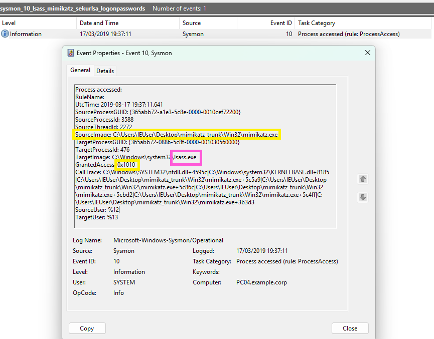

# 🕵️‍♀️ Incident Investigation: LSASS Credential Dumping via Mimikatz (T1003.001)

**Data Source:** [JPCERT EVTX-ATTACK-SAMPLES dataset](https://github.com/sbousseaden/EVTX-ATTACK-SAMPLES/blob/master/Credential%20Access/sysmon_10_lsass_mimikatz_sekurlsa_logonpasswords.evtx/)

**Analyst:** Magda Dominguez

**Status:** Resolved

**MITRE ATT&CK:** [T1003.001 - OS Credential Dumping: LSASS Memory](https://attack.mitre.org/techniques/T1003/001/)

## 1. Executive Summary
A critical security event was detected involving unauthorized access to the Local Security Authority Subsystem Service (`lsass.exe`) process memory. The telemetry indicates the execution of the well-known credential extraction tool, Mimikatz, directly from a user's desktop, successfully requesting memory read access to LSASS. 

## 2. Triggering Event (The Alert)
The investigation was initiated by a Sysmon Event ID 10 (ProcessAccess) alert. This event is triggered when a process opens a handle to another process, which is heavily monitored when the target is `lsass.exe` due to its role in managing system credentials.

## 3. Log Analysis & Evidence

### Sysmon Event ID 10 (Process Access)
The following telemetry was captured during the triage phase:

**Key Finding Breakdown:**
*   **SourceImage:** `C:\Users\IEUser\Desktop\mimikatz_trunk\Win32\mimikatz.exe`
    *   *Analysis:* The attacker dropped and executed the Mimikatz binary directly from the user's desktop environment.
*   **TargetImage:** `C:\Windows\system32\lsass.exe`
    *   *Analysis:* Confirms the target is the LSASS process, which stores active credentials in memory.
*   **GrantedAccess:** `0x1010`
    *   *Analysis:* This specific hexadecimal code represents `PROCESS_VM_READ` (0x0010) and `PROCESS_QUERY_LIMITED_INFORMATION` (0x1000). This is a massive red flag, as it proves the source process requested and was granted the exact permissions needed to read and dump the memory of LSASS.
*   **CallTrace:** 
    *   *Analysis:* The call stack confirms the execution flow originated from the `mimikatz.exe` binary itself, validating the source of the malicious API call.

## 4. Conclusion
This is a **True Positive** for Credential Access. An attacker successfully executed Mimikatz (specifically utilizing modules like `sekurlsa::logonpasswords` based on the requested access rights) to dump credentials from memory. 

In a real-world scenario, the immediate response would involve isolating the host (PC04.example.corp), resetting the compromised user's credentials (and potentially any service accounts exposed on that host), and initiating a wider hunt for lateral movement originating from this endpoint.