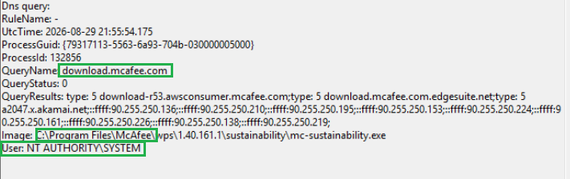

# Sysmon Event ID 22  McAfee Antivirus Signature Ingestion & Multicloud CDN

## Executive Summary
This case documents a benign Sysmon Event ID 22 (DNS Query) generated by McAfee’s endpoint protection update subsystem.
The process `mc-sustainability.exe` performs routine signature ingestion by querying `download.mcafee.com`, which resolves through a multicloud CDN chain involving Amazon Route 53 and Akamai EdgeSuite.
This behaviour is expected for enterprise antivirus platforms and represents legitimate security maintenance traffic.

## Evidence Extract

* **Event Type:** Sysmon Event ID 22 (DNSEvent)
* **Timestamp (UTC):** `2026-08-29 21:55:54.175`
* **Process:** `C:\Program Files\McAfee\wps\1.40.161.1\sustainability\mc-sustainability.exe`
* **PID / GUID:** `132856` | `{79317113-5563-6a93-704b-030000005000}`
* **Query Name:** `download.mcafee.com`
* **Resolved Addresses:** Multi-IP CDN Pool (`90.255.250.136`, `90.255.250.210`, etc.)
* **User Context:** `NT AUTHORITY\SYSTEM` (Elevated system service)

## Technical Investigation

### 1. Multicloud CNAME Resolution Chain
The DNS resolution path demonstrates a typical vendor CDN architecture:
* `download.mcafee.com`  
* ↓  
* Amazon Route 53 entrypoint (`download-r53.awsconsumer.mcafee.com`)  
* ↓  
* Akamai EdgeSuite distribution nodes (`edgesuite.net`, `akamai.net`)  
* ↓  
* Final CDN pool (`90.255.250.0/24`) delivering antivirus definition updates  

This pipeline ensures global low‑latency distribution of McAfee engine patches and signature files.

### 2. Binary Legitimacy & Privilege Context
* **Binary Path:** Located under `C:\Program Files\McAfee\wps\...`, consistent with official McAfee installations.
* **Privilege Level:** Executes as `NT AUTHORITY\SYSTEM`, required for updating core antivirus components without user interaction.
* **Operational Role:** The sustainability module handles update orchestration, telemetry, and engine maintenance.

### 3. SOC Triage & Threat Assessment
* **Process‑to‑Destination Coherence:** A McAfee security binary contacting its vendor’s update infrastructure is fully expected.
* **Masquerading Check:** No anomalies in binary path, signature, or DNS hierarchy.
* **Threat Context:** No indicators of C2, tunnelling, or domain hijacking.
* **Baseline Behaviour:** Matches known antivirus update patterns observed across enterprise environments.

 📗**Benign Triage Checklist**

| Criterion | Status |
| :--- | :--- |
| Canonical vendor binary path | ✔ Legitimate |
| SYSTEM‑level antivirus update process | ✔ Expected |
| Vendor CDN chain (Route 53 → Akamai) | ✔ Standard |
| Multi‑IP pool for load balancing | ✔ Normal |
| No suspicious parent process | ✔ Clean |
| No anomalous DNS entropy | ✔ Human‑readable vendor domain |

**Result:** Meets all criteria for Benign Positive classification.

## MITRE ATT&CK Mapping

| Attribute | Detail |
| :--- | :--- |
| **Tactic** | Command & Control (TA0011) |
| **Technique** | Application Layer Protocol (T1071) |
| **Sub‑Technique** | DNS (T1071.004) |
| **Classification** | Benign Positive — Antivirus Update Telemetry |

## Triage Conclusion
* **Classification:** Benign Positive
* **Risk Rating:** Informational (Low)
* **Action:** No remediation required. Logged as baseline antivirus update behaviour.
---

🌱 *Authored by: Magda Dominguez*  
*Security Operations • Detection Engineering • Blue Team*