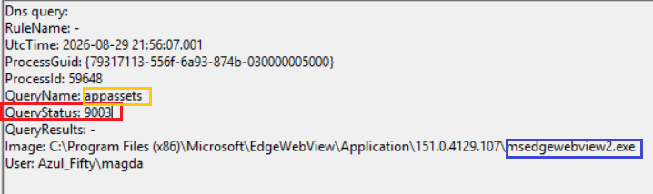

# Sysmon Event ID 22 
# WebView2 Virtual Hostname & NXDOMAIN Analysis

## 💠 Executive Summary
This case documents a benign Sysmon Event ID 22 (DNS Query) generated by Microsoft Edge WebView2, where the embedded Chromium networking stack attempts to resolve a single‑label virtual hostname (`appassets`).
Because the string is not a valid FQDN, the system resolver returns NXDOMAIN (RCODE 3).
This behaviour is expected, non‑malicious, and commonly observed in applications using WebView2 for UI rendering.
Understanding this pattern is essential for SOC analysts to avoid misclassifying isolated NXDOMAIN events as DGA‑like behaviour.

## 💠Evidence Extract



```js
Event Type: Sysmon Event ID 22 (DNSEvent)
UtcTime: 2026-08-29 21:56:07.001
Process: C:\Program Files (x86)\Microsoft\EdgeWebView\Application\151.0.4129.107\msedgewebview2.exe
ProcessId: 59648
ProcessGuid: {79317113-556f-6a93-874b-030000005000}
QueryName: appassets
QueryStatus: 9003 (NXDOMAIN)
QueryResults: -
User: Azul_Fifty\magda
```


## 💠Technical Investigation

### 1. DNS Resolution Failure (RCODE 3 / NXDOMAIN)
* **Status Code Meaning:** 9003 corresponds to `DNS_ERROR_RCODE_NAME_ERROR`, indicating the queried name does not exist in any authoritative DNS zone.
* **Reason:** `appassets` is a single‑label hostname, not a valid FQDN.
* **Outcome:** The resolver returns NXDOMAIN, and Sysmon logs an empty result set.

### 2. WebView2 Virtual Hostname Mechanics
* **Binary Role:** `msedgewebview2.exe` is the embedded Chromium engine used by desktop applications to render modern web‑based interfaces.
* **Virtual Host Mapping:** Applications frequently define internal pseudo‑domains (e.g., `appassets`, `localapp`, `runtime`) to load local HTML/CSS/JS assets securely.
* **Leak to OS Resolver:** Under certain loading routines, Chromium attempts to resolve these internal hostnames externally, producing a harmless NXDOMAIN event.

### 3. SOC Triage & Threat Hunting Context
**NXDOMAIN** is a high‑value signal in threat hunting, especially when:
* appearing in high‑volume bursts,
* containing high‑entropy strings,
* matching DGA patterns,
* originating from non‑browser processes.

However, this case shows none of those characteristics:
* single event
* human‑readable string (`appassets`)
* browser‑related process
* standard user context
* legitimate UI rendering behaviour

 **Benign Triage Checklist**

| Criterion | Status |
| :--- | :--- |
| Canonical binary path (System32 or Program Files) | ✔ Legitimate |
| Known WebView2 behaviour | ✔ Expected |
| Single‑label hostname | ✔ Non‑FQDN → NXDOMAIN |
| No entropy / no DGA characteristics | ✔ Human‑readable |
| No suspicious parent process | ✔ Normal application runtime |
| No repeated NXDOMAIN bursts | ✔ Single event |

> **Result:** Meets all criteria for Benign Positive classification.

## 💠 MITRE ATT&CK Mapping

| Attribute | Detail |
| :--- | :--- |
| **Tactic** | Command & Control (TA0011) |
| **Technique** | Application Layer Protocol (T1071) |
| **Sub‑Technique** | DNS (T1071.004) |
| **Classification** | Benign Positive — UI Virtual Hostname Resolution |

## 💠 Triage Conclusion
* **Classification:** Benign Positive
* **Risk Rating:** Informational (Low)
* **Action:** No remediation required. Logged as expected WebView2 internal networking behaviour.
---
## 👩🏽‍💻 *Authored by: Magda Dominguez*  
*Security Operations • Detection Engineering • Blue Team*