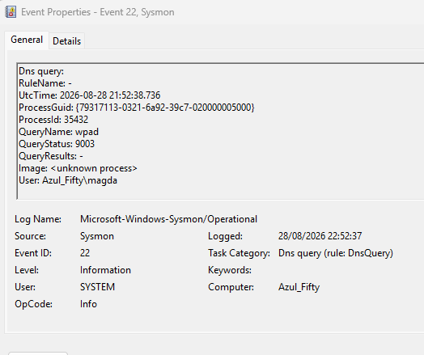

# 🖧 Sysmon Event ID 22 : DNS Query
### WPAD Resolution Attempt - Network Auto-Discovery Behaviour

This evidence captures a **DNS Query** to `wpad`, a domain used by Windows for **Web Proxy Auto-Discovery Protocol (WPAD)**. WPAD is a legacy mechanism that allows systems to automatically discover proxy configuration files on a network. Although WPAD can be abused in attacks (WPAD poisoning), this event is **benign** and part of normal Windows network behaviour.

---

## 📸 Evidence Screenshot

---

## 📋 Evidence Extract

| Field | Value | Interpretation |
| :--- | :--- | :--- |
| **QueryName** | `wpad` | Windows proxy auto-discovery lookup |
| **QueryStatus** | `9003 (NXDOMAIN)` | Domain does not exist (No WPAD server present) |
| **Image** | `<unknown process>` | Short-lived process typical of transient network events |
| **User** | `Azul_Fifty\magda` | Standard user context (No privilege escalation) |
| **ProcessId** | `35432` | Ephemeral process ID |
| **Timestamp** | `2026-08-28 21:52:38.736` | Local system event time |

---

## 🔍 Highlighted Indicators

* 🟩 **QueryName (`wpad`):** Windows automatically attempts to resolve `wpad` when connecting to networks as part of proxy auto-configuration discovery.
* 🟦 **QueryStatus (`9003 - NXDOMAIN`):** The DNS server responded that the domain does not exist, confirming no rogue or internal WPAD server is active.
* 🟨 **Image (`<unknown process>`):** Sysmon could not capture the process image because the process terminated quickly—a pattern common to lightweight network discovery calls.
* 🟩 **User (`Azul_Fifty\magda`):** The query executed strictly under standard user context without SYSTEM-level execution.

---

## 🔹 Protocol Context: What Is WPAD?

**Web Proxy Auto-Discovery Protocol (WPAD)** enables endpoints to automatically locate proxy servers, PAC files, and network configuration policies. Common triggers include:

* Initial system boot
* Connecting or switching Wi-Fi / Ethernet networks
* Launching web browsers
* Refreshing network adapter settings

---

## 🔹 WPAD Threat Model & Attack Surface

In offensive security, WPAD is frequently targeted for:

* **WPAD Spoofing / Poisoning:** Deploying a rogue WPAD server to serve malicious PAC files.
* **Adversary-in-the-Middle (AiTM):** Intercepting and inspecting unencrypted HTTP/HTTPS traffic through rogue proxy routes.
* **Credential Harvesting:** Forcing endpoints through fake upstream proxies that prompt for NTLM challenge-response handshakes.

---

## ⚖️ Benign vs. Malicious Indicators

| Evaluation Factor | 🟢 Benign (Observed Case) | 🔴 Malicious (WPAD Poisoning) |
| :--- | :--- | :--- |
| **DNS Resolution** | `NXDOMAIN` (Domain does not exist) | Successfully resolves to internal/attacker IP |
| **PAC File Download** | None | Retrieved via HTTP/HTTPS |
| **Proxy Settings** | Unaltered system state | Modified to route through unauthorized proxy |
| **Process Context** | User execution / Short-lived PID | Suspicious parent processes or persistence tools |
| **Follow-on Traffic** | None (Sysmon Event ID 3 absent) | Outbound connection to unexpected remote endpoint |

---

## 🛡️ SOC Triage Assessment & Conclusion

* **Verdict:** Benign Positive (Normal Operating System Noise)
* **Rationale:** The DNS query returned `NXDOMAIN`, confirming no WPAD configuration was retrieved. No secondary indicators (PAC downloads, proxy modification, or outbound rogue connections) were observed.

---

## 🗺️ MITRE ATT&CK Mapping

While benign in this instance, WPAD exploitation maps to:

* **T1557** — Adversary-in-the-Middle
* **T1557.001** — LLMNR/NBT-NS Poisoning and SMB Relay
* **T1557.002** — ARP Cache Poisoning

---

## 📝 Analyst Notes

This case demonstrates how Windows performs automatic WPAD resolution during routine network operations. Understanding these baseline events is critical for differentiating benign network discovery noise from active WPAD poisoning and AiTM techniques in enterprise environments.

---
## ♟️ **Authored by:** **Magda Dominguez**  
Security Operations • Detection Engineering • Blue Team
