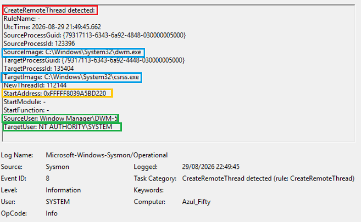

# Case Study: Sysmon Event ID 8 
### **Desktop Window Manager to CSRSS Remote Thread Creation**

## Telemetry Summary

* **Event Type:** Sysmon Event ID 8 (CreateRemoteThread)
* **Timestamp (UTC):** `2026-08-29 21:49:45.662`
* **Source Process:** `C:\Windows\System32\dwm.exe` (Desktop Window Manager)
* **Source PID / GUID:** `123396` | `{79317113-6343-6a92-4848-030000005000}`
* **Source User:** `Window Manager\DWM-5` (Virtual service account for Session 5)
* **Target Process:** `C:\Windows\System32\csrss.exe` (Client/Server Runtime Subsystem)
* **Target PID / GUID:** `135404` | `{79317113-6343-6a92-4448-030000005000}`
* **Target User:** `NT AUTHORITY\SYSTEM`
* **New Thread ID:** `112144`
* **Start Address:** `0xFFFFF8039A5BD220` (Kernel/System mapped memory space)

---

## Technical Investigation

### 1. Process Roles & Subsystem Architecture
* **Source Component (`dwm.exe`):** Responsible for managing modern desktop composition, visual hardware-accelerated rendering, and graphical window buffering.
* **Target Component (`csrss.exe`):** The core user-mode execution monitor and Win32 runtime subsystem responsible for thread lifecycle control, console handling, and OS session maintenance.

### 2. Mechanism & Behavioral Justification
* **Inter-Process Synchronization:** High-performance graphical pipeline operations require low-overhead synchronization between DWM and CSRSS. DWM utilizes native Windows API calls to spawn synchronization worker threads directly within the CSRSS execution boundary during desktop session lifecycle transitions.
* **Integrity & Session Boundaries:** The operation originates from the dedicated virtual session account (`Window Manager\DWM-5`) targeting the local system subsystem (`NT AUTHORITY\SYSTEM`), matching expected Windows OS graphics architecture.

### 3. SOC Triage & Threat Hunting Perspective (MITRE ATT&CK T1055.002)
* **Process Injection Context:** `CreateRemoteThread` is heavily monitored as a primary vehicle for DLL injection, shellcode execution, and defense evasion. Non-standard source binaries (e.g. script interpreters, office suites, or user-space temp binaries) targeting system processes represent high-fidelity malicious indicators.
* **False Positive Baseline Rule:** Direct interaction between `C:\Windows\System32\dwm.exe` and `C:\Windows\System32\csrss.exe` represents a well-documented operating system baseline pattern and should be tuned as an expected benign positive in SIEM/EDR detection rules.

---

## Triage Conclusion
* **Classification:** Benign Positive (Legitimate Core OS Graphics Subsystem Thread Creation)
* **Risk Rating:** Informational (Low)
* **Action:** Documented as an architectural baseline for inter-process communication in Windows UI rendering.

