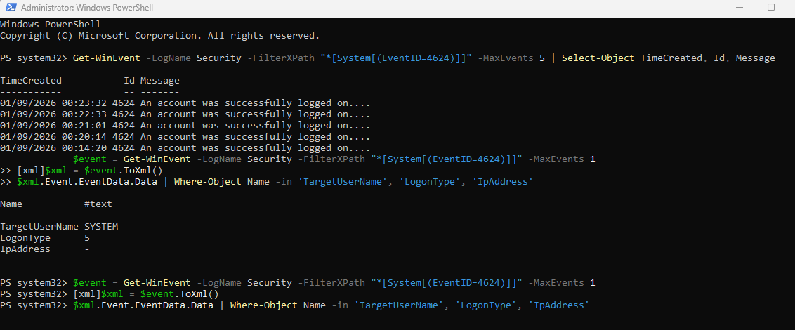
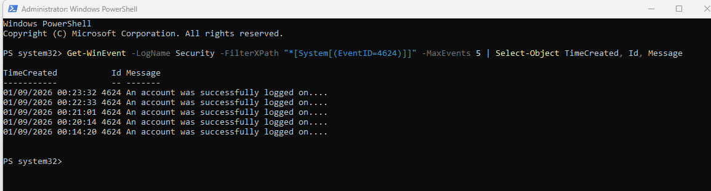
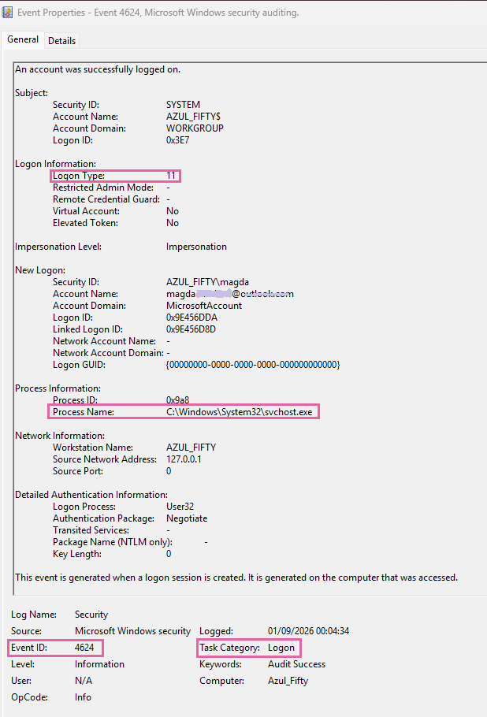

# Security Event Analysis: Successful Logon (Event ID 4624)

## 🟢 Summary

This analysis explores **Event ID 4624 (Successful Logon)**, a critical Windows Security Log generated every time an account successfully authenticates to a system. While a 4624 event represents normal behavior, analyzing its specific **Logon Type** is essential for SOC Analysts to distinguish between legitimate user activity, background service executions, and potential lateral movement or unauthorized access.

## 🟢 Case Study 1: Service Logon Analysis via PowerShell (Logon Type 5)

To investigate logon activity efficiently, PowerShell's `Get-WinEvent` cmdlet was utilized to query the Security log and extract the most recent 4624 events.

By parsing the event data as XML, specific fields (`TargetUserName`, `LogonType`, and `IpAddress`) were extracted for a cleaner analysis:

The analysis revealed the following artifacts:
*   **TargetUserName: SYSTEM:** The highest privileged local account in Windows.
*   **Logon Type: 5 (Service):** Indicates that a service or scheduled task started and authenticated as the SYSTEM account. 
*   **Verdict:** Typical, benign background activity required by the Windows operating system to run local services. It does not indicate an interactive user session.

## 🟢 Case Study 2: Cached Interactive Logon (Logon Type 11)

A detailed review of a separate Event 4624 using the Windows Event Viewer GUI highlighted a different authentication method on the endpoint `AZUL_FIFTY`.

Key event properties include:
*   **Logon Type: 11 (Cached Interactive):** Occurs when a user logs on locally using credentials that the system has cached from a previous successful authentication.
*   **Process Name:** `C:\Windows\System32\svchost.exe` (The legitimate host process for Windows services).
*   **Source Network Address:** `127.0.0.1` (Localhost, confirming this was a local action).
*   **Verdict:** Legitimate local user authentication via cached credentials. 

## 🟢 Security Recommendations & Threat Hunting Context

While Event 4624 is an "Audit Success," it is a primary pivot point during incident response. Defenders should focus on:
1.  **Monitoring High-Risk Logon Types:** Watch for unusual spikes in **Logon Type 10 (RemoteInteractive / RDP)** or **Logon Type 3 (Network / SMB)**, especially if they follow a series of Event 4625 (Failed Logons).
2.  **Tracking Privileged Accounts:** Set up alerts for any interactive logons involving highly privileged service accounts.
3.  **Lateral Movement Detection:** Correlate Logon Type 3 events with unexpected source IP addresses to detect threat actors moving across the network.

## 🪪 Author

**Magda Dominguez**
*SOC Analyst (L1-ready) | Bristol, UK*
Focused on Blue Team operations, detection engineering and log analysis.