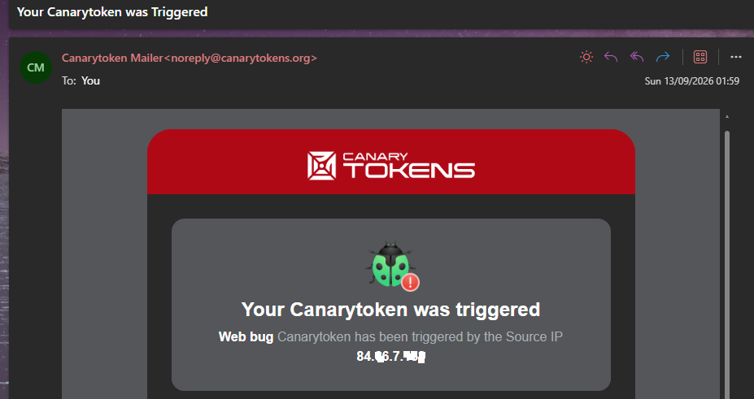

# Security Event Analysis
# Active Defense & Cyber Deception (Honeytokens)

## 🔻Summary
Traditional Security Operations often rely on reactive detection mechanisms, which can suffer from high false-positive rates and alert fatigue. This case study explores a proactive **Active Defence** approach using cyber deception, specifically the deployment of a *Honeytoken*. 

By strategically placing a tracked, fictitious asset (a decoy document) within a network, SOC analysts can achieve high-fidelity alerts. Any interaction with this decoy provides a definitive indicator of unauthorised access, lateral movement, or insider threat behaviour with a 0% false-positive rate.

---

## 🔻Phase 1: Decoy Deployment & Strategy

**Analysis:**
To simulate an attractive target for an adversary or a malicious insider, a macro-less Microsoft Word document was generated using Canarytokens. 

*   **Asset Naming Convention:** The file was deliberately named `Confidential_Salaries_2026.docx` to exploit attacker curiosity and automated data-discovery scripts. 
*   **Placement Strategy:** In a real-world enterprise environment, such files are strategically placed in accessible, yet rarely used, SharePoint directories, unprotected file shares, or dummy user desktops. Legitimate users have no business rationale to interact with this file.

---

## 🔻Phase 2: Trigger & High-Fidelity Detection

**Analysis:**
Upon opening the decoy document, a hidden web bug (a tracking pixel) embedded within the file structure executed a DNS/HTTP request to the Canarytoken server, immediately generating a high-priority alert.

*   **Telemetry Captured:** The alert instantly provided critical triage information, including the source IP address, the timestamp of the interaction, and user-agent details.
*   **Incident Response Value:** Because interaction with this file is strictly prohibited by its very nature, the SOC can immediately escalate this alert to a critical incident, bypassing the standard triage and verification queues. It definitively confirms that an entity is actively browsing the file system for sensitive data.

---

## 🔻MITRE ATT&CK & D3FEND Mapping
*   **ATT&CK - [T1005](https://attack.mitre.org/techniques/T1005/) Data from Local System:** The decoy detects adversaries attempting to collect sensitive data from local endpoints.
*   **ATT&CK - [T1083](https://attack.mitre.org/techniques/T1083/) File and Directory Discovery:** Detects automated scripts or manual enumeration of local files.
*   **D3FEND - [D3-DO](https://d3fend.mitre.org/technique/d3f:DecoyObject/) Decoy Object:** The employment of a deceptive digital object to elicit adversary interaction.

## 🔻Author
**Magda Dominguez**  
*SOC Analyst (L1-ready) Bristol, UK*  
Focused on Blue Team operations, detection engineering and log analysis.