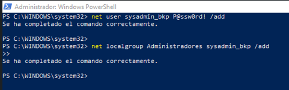
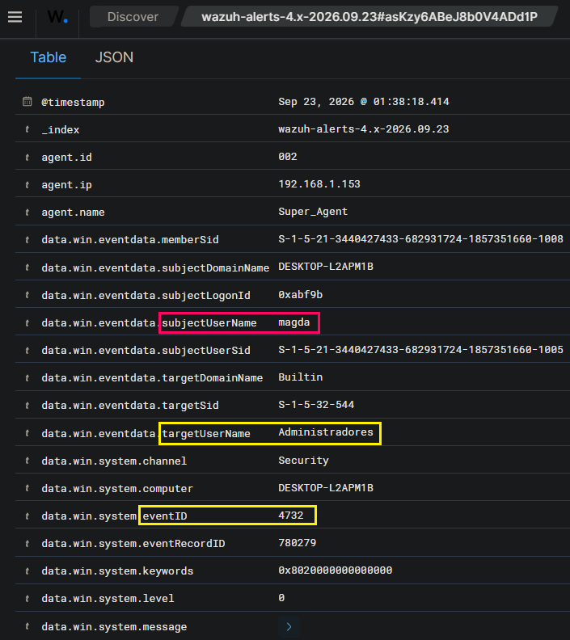

# SOC Lab Investigation: Local Account Creation & Persistence (T1136.001)

**Objective:** To simulate and detect an adversary establishing persistence within a compromised Windows environment by creating a hidden local administrator account, and to analyse the corresponding telemetry generated by the Wazuh SIEM.

## Red Team: Execution & Persistence
Following an assumed initial compromise, the adversary attempts to secure persistent administrative access to the endpoint. This ensures continued control even if the original entry vector is remediated.

* An elevated PowerShell session was utilised to bypass standard user access controls.
* A hidden local user account (`sysadmin_bkp`) was silently provisioned.
* The newly created account was immediately added to the local `Administrators` group to grant full system privileges.

## Blue Team: Detection & Telemetry Analysis
The endpoint's audit policies successfully captured the unauthorized account manipulation. The Wazuh agent forwarded these logs to the SIEM, resulting in a critical severity alert for the privilege escalation.

* **Events Detected:** Event ID 4720 (Account Creation) followed by Event ID 4732 (Member added to a privileged group).
* **Primary Rule Triggered:** Administrators Group Changed
* **Severity Level:** 12 (Critical)
* **Target Group:** Administradores
* **Compromised Account:** magda
* **Agent:** Super_Agent

![[Wazuh SIEM dashboard displaying chronological correlation between account creation and privilege escalation]](./screenshots/administrators.png)

## Triage & Incident Response Recommendations
The creation of an unauthorised administrative account is a critical security incident. The following response actions are recommended:

1. **Immediate Isolation:** Isolate the affected endpoint from the corporate network to prevent lateral movement.
2. **Account Remediation:** Immediately disable and remove the malicious account (`sysadmin_bkp`). 
3. **Root Cause Analysis:** Investigate prior logs (such as RDP authentications, PowerShell executions, or malformed processes) to determine exactly how the adversary gained the initial access required to execute these commands.
4. **Credential Reset:** Enforce a password reset for all legitimate administrative accounts that accessed the compromised endpoint recently.  

##  Author
**Magda Dominguez**  
*Security Operations 🔸 Detection Engineering 🔸 Blue Team*