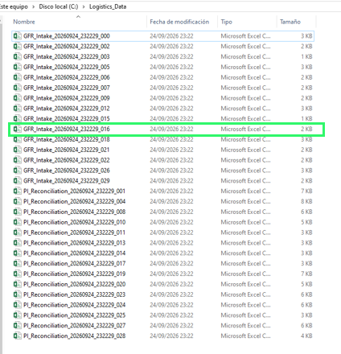
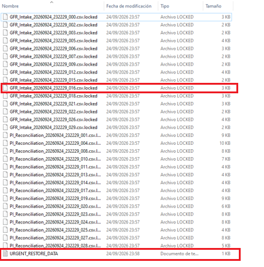
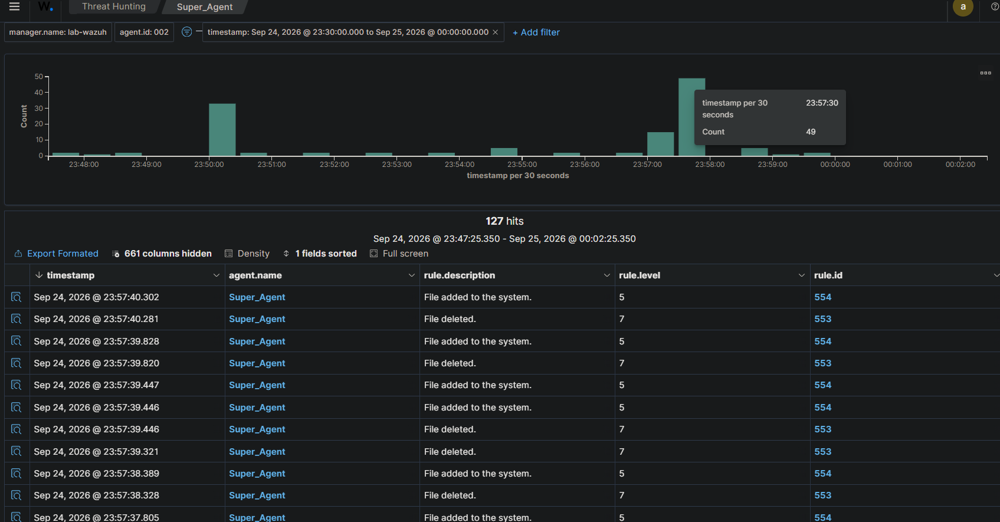
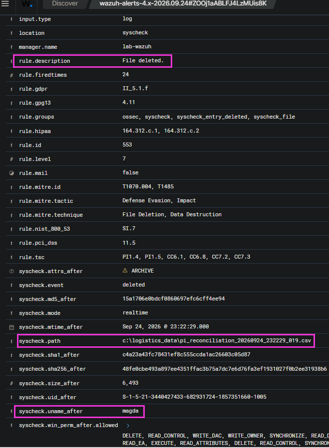

# 🦠 Ransomware Emulation & File Integrity Monitoring (FIM)

## ◾ Overview
This project documents a custom detection engineering laboratory focused on **File Integrity Monitoring (FIM)** and ransomware behaviour analysis. 

Instead of testing against empty directories, this lab leverages **Software & Data Engineering** principles to simulate a realistic corporate logistics endpoint. Python scripts are used to dynamically generate Perpetual Inventory (PI) and Good Faith Receiving (GFR) datasets. 

A secondary Python script then emulates a ransomware encryption event, triggering mass file modification telemetry which is subsequently triaged within the Wazuh SIEM.

## ◾ Lab Architecture & Tools

* **Data Generation (Python):** 

    Automated creation of realistic `.csv` and `.xlsx` logistics reports to populate the target directory (`C:\Logistics_Data\`).
* **Threat Emulation (Python):** 

    A custom script designed to iterate through the target directory, alter file contents, append a `.locked` extension, and drop a ransom note.
* **Detection Sensor (Wazuh `syscheck`):** 

    The Wazuh agent configured to monitor the logistics directory for real-time file creation, modification, and deletion.
* **SIEM / Manager (Ubuntu):** 

    Centralised logging and alert correlation.

## ◾ Detection Capabilities & MITRE ATT&CK Mapping

This investigation focuses on identifying the cryptographic and destructive phases of a ransomware lifecycle:
* **T1486 (Data Encrypted for Impact):** 

    Mass file extension changes and content modification.
* **T1485 (Data Destruction):** 

    Deletion of original system files following encryption.
* **T1490 (Inhibit System Recovery):** 

    Modifying critical operational data (simulated PI records).

## ◾ Investigation Phases

1. **Data Engineering & Sensor Setup:** 

    Generating the logistics environment and configuring the Wazuh `ossec.conf` file to protect business-critical assets.

    

2. **Execution & Emulation:** 

    Running the Python encryption payload to detonate the localized attack.

    

3. **Blue Team Triage:** 

    Analysing the FIM alert storm, correlating the `rule.description` and `syscheck.path` fields, and documenting the incident.

---

## ◻️ Blue Team: FIM Alert Triage & Ransomware Detection

Once the offensive emulator is executed, the Wazuh Syscheck module immediately detects a mass alteration in the `C:\Logistics_Data\` directory. 

As these are critical Perpetual Inventory reconciliation and Good Faith Receiving (GFR) files, early identification of these patterns is vital to prevent halting inbound logistics operations.

### 1. Alert Storm (Macro Analysis)
In the Wazuh dashboard, an anomalous spike of File Integrity Monitoring (FIM) events is observed, concentrated within milliseconds. 

This execution speed is the primary indicator of automated activity characteristic of ransomware.

*   **Rule ID 550 (Integrity checksum changed):** 

    Triggers initially when the payload overwrites the original content of the logistics records, irreversibly modifying their MD5/SHA1 hashes.
*   **Rule ID 553 (File deleted):** 

    Registered as the original `.csv` files disappear from the system.
*   **Rule ID 554 (File added):** 

    Triggers simultaneously due to the appearance of new files featuring the malicious `.locked` extension.

### 2. Log Triage & IoC Extraction (Micro Analysis)
Expanding the critical logs reveals the exact nature of the compromise. 

The telemetry explicitly captures the malicious modifications against specific logistics files. 

[]

Amidst the volume of modifications, a specific file creation event (Rule 554) breaks from standard inventory nomenclature:
*   **File Path:** `C:\Logistics_Data\URGENT_RESTORE_DATA.txt`

*   This artefact confirms the nature of the incident, operating as a classic Indicator of Compromise (IoC) for an extortion campaign.

### 3. MITRE ATT&CK Tactical Mapping
*   **T1486 (Data Encrypted for Impact):** 

    Evidenced by the mass change of extensions to `.locked` and the destructive alteration of the data.
*   **T1485 (Data Destruction):** 

    Resulting in the immediate loss of access to operational data, paralysing stock visibility within the WMS.

### 4. Containment & Incident Response (IR) Actions
1.  **Network Isolation (Containment):** 

    Immediately disconnect the compromised endpoint to prevent the encryption process from reaching shared network drives or inventory database servers.
2.  **Root Cause Analysis:** 

    Pivot to Sysmon logs (Event ID 1: Process Creation and Event ID 11: File Create) in the minutes preceding the FIM storm to identify the parent process that detonated the malicious script.
3.  **Business Continuity Plan (BCP) Activation:**

    Escalate the incident to logistics managers to initiate paper-based contingency procedures for Perpetual Inventory, whilst the infrastructure team restores data from immutable backups.

---
## ◻️ Author
**Magda Dominguez**  
*Security Operations ◻️ Detection Engineering ◻️ Blue Team*