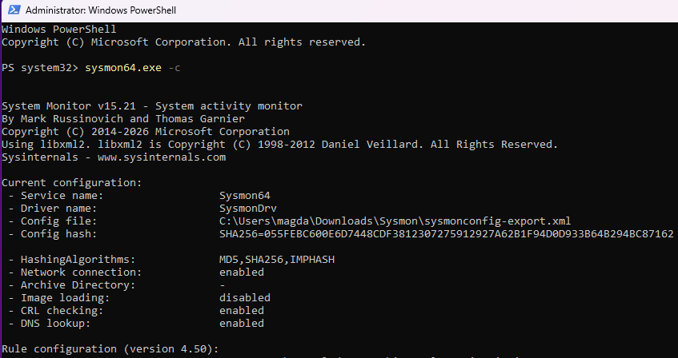
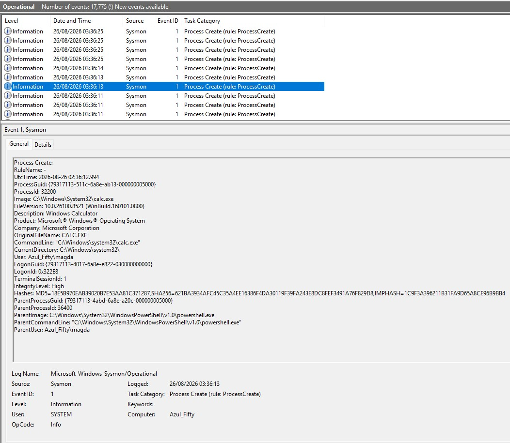

## Day 1  Sysmon Basics  -- 
### 1. What is Sysmon?

Sysmon is a component of the Sysinternals suite that provides high‑fidelity telemetry about process creation, network activity, registry modifications, driver loading, and other system behaviour.
It is widely used in Security Operations Centres (SOCs) because it exposes detailed, security‑relevant events that are not available in standard Windows logs.

For an analyst, Sysmon is invaluable: it helps identify suspicious execution patterns, detect malware activity, and understand how processes interact within the operating system.

### 2. Sysmon Installation
Below is the evidence of Sysmon being successfully installed on the system, including the version, configuration file, and hashing algorithms in use.

### 3. Sysmon Configuration
The configuration file used is based on the widely adopted SwiftOnSecurity Sysmon configuration, which provides a balanced and practical set of rules for monitoring process creation, network connections, registry changes, and more.

The configuration summary shows:

* the Sysmon service and driver names

* the exact configuration file in use

* the SHA‑256 hash of the configuration

* enabled monitoring features (e.g., network connections, DNS lookups)

* hashing algorithms (MD5, SHA256, IMPHASH)

### 4. Sysmon Event ID 1  
### **_Process Creation_**

In this exercise, I executed calc.exe   to generate a clean and controlled event.    

**Event ID 1** records detailed information whenever a process is created.

### 5. Event Analysis
The Process Create (Event ID 1) event provides high‑fidelity visibility into how processes are launched within Windows.
This information is essential for SOC analysts, as it allows them to identify suspicious behaviour, detect malware execution, and understand parent‑child process relationships.

In this exercise, the execution of calc.exe produced a clean and controlled Event ID 1 entry.
Key fields include:

   * Image — the full path of the executable (calc.exe).
    `C:\Windows\System32\calc.exe`

* CommandLine — how the process was launched.
`"C:\Windows\System32\calc.exe"`

* ParentImage — the process responsible for launching it (PowerShell in this case).   `C:\Windows\System32\WindowsPowerShell\v1.0\powershell.exe`

* ParentCommandLine — how the parent process was invoked.
`"C:\Windows\System32\WindowsPowerShell\v1.0\powershell.exe"`

* User — the account under which the process was executed.
`Azul_Fifty`

* IntegrityLevel — privilege level of the process. `High`

* Hashes — MD5, SHA256 and ImpHash values used for file identification.
`MD5=...` `SHA256=...` `IMPHASH=...`

* ParentUser `Azul_Fifty\magda`

---

### Main Takeway
**Sysmon’s Process Create events can reveal a wide range of suspicious or malicious behaviour.**

For example:

**Malware execution** 
A process such as `cmd.exe` launching an unknown `.exe` from `Downloads` or `Temp`.

**Suspicious scripting activity**  
PowerShell running with encoded commands, e.g.
`powershell.exe -enc <base64>`.

**LOLBin abuse (Living‑off‑the‑Land Binaries)**  
Legitimate Windows tools used maliciously, such as:
`rundll32.exe` loading a suspicious DLL,
or `wmic.exe` spawning unexpected processes.

**Unusual parent/child relationships**  
For example, `winword.exe` spawning `powershell.exe`, which is a common sign of macro‑based attacks.

**Privilege escalation attempts**  
A low‑integrity process spawning a high‑integrity child process.

**Execution from non‑standard locations** 
Processes launched from user‑writable directories such as:
`C:\Users\<user>\AppData\Roaming\ `
or
`C:\Users\<user>\Downloads\`

---
---

**_That wraps up the checks for Sysmon, it’s installed properly and logging exactly as it should._**

**_All set to move on to Day 2, where I’ll dig into network activity and start looking at Event ID 3._**

