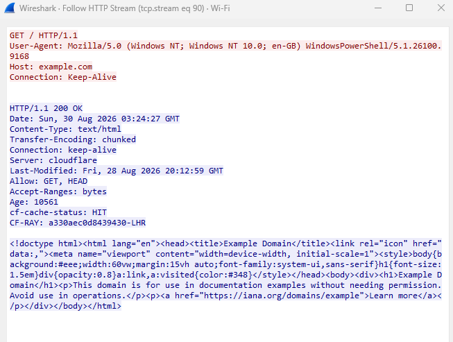

# Day 2 : Sysmon Activity Correlation & Telemetry Analysis

## 🔷 Overview
This case study demonstrates the correlation of three distinct Sysmon events generated by a single PowerShell process lifecycle.  
The primary objective is to trace the execution chain across **Process Creation (Event ID 1)**, **File System Activity (Event ID 11)**, and **Outbound Network Communication (Event ID 3)**, distinguishing legitimate runtime artifacts from potential adversary techniques mapped to **MITRE ATT&CK**.

---

## 🔷 Process Correlation Context

The following shared process attributes establish the core pivot for cross-event correlation:

| Field | Value |
|---|---|
| **ProcessId** | `17208` |
| **ProcessGuid** | `{79317113-17c1-6a90-8e00-010000005000}` |
| **Image** | `C:\Windows\System32\WindowsPowerShell\v1.0\powershell.exe` |

---

## 🔷 MITRE ATT&CK Telemetry Mapping

| Event ID | UtcTime | Event Type | Observed Details | MITRE Tactic | MITRE Technique / Behavior |
|:---:|:---:|:---:|:---|:---:|:---|
| **1** | 2026-08-27 10:56:01 | Process Create | `powershell.exe Invoke-WebRequest http://example.com` | **Execution (TA0002)** | **T1059.001 — Command and Scripting Interpreter: PowerShell** |
| **11** | 2026-08-27 10:56:01 | File Create | `__PSScriptPolicyTest_rrbbi1oz.mt1.ps1` | **Execution (TA0002)** | **T1059.001 — Host Engine Policy Validation Artifact** |
| **3** | 2026-08-27 10:56:02 | Network Connect | Dest IP: `2606:4700:10::6814:179a`, Dest Port: `80` (HTTP) | **Command & Control (TA0011)** | **T1071.001 — Application Layer Protocol: Web Protocols** |

---

## 🔷 Forensic Interpretation

### **1️⃣ Process Create (Sysmon Event ID 1)**
* **Observation:** PowerShell is executed with the command-line argument `Invoke-WebRequest http://example.com`.
* **SOC Context:** Represents initial command execution leveraging native system shells (LOLBin execution). While commonly used for administrative scripts, unmonitored PowerShell web requests can serve as stagers for initial access or payload delivery.
* **Mapping:** **MITRE ATT&CK T1059.001 (PowerShell)**.

---

### **2️⃣ File Create (Sysmon Event ID 11)**
* **Observation:** Creation of a temporary script file: `__PSScriptPolicyTest_rrbbi1oz.mt1.ps1` in the user's `Temp` directory.
* **SOC Context:** This is an internal Windows PowerShell engine artifact generated automatically upon startup to test AppLocker and Execution Policy enforcement (*ConstrainedLanguage* vs *FullLanguage* mode). Documenting this artifact is crucial for baseline noise tuning and distinguishing system tests from malicious script droppers.
* **Mapping:** **Benign Host Policy Verification Artifact (PowerShell Engine)**.

---

### **3️⃣ Network Connect (Sysmon Event ID 3)**
* **Observation:** Outbound IPv6 TCP connection initiated by `powershell.exe` to `[2606:4700:10::6814:179a]:80` (`example.com` via Cloudflare CDN).
* **SOC Context:** Standard unencrypted HTTP network communication. In enterprise SOC triage, native shell binaries establishing direct external web sockets warrant immediate inspection to rule out C2 beaconing or secondary payload staging (*T1105 - Ingress Tool Transfer*).
* **Mapping:** **MITRE ATT&CK T1071.001 (Web Protocols)**.

---

## 🖼 Visual Evidence

### **Process Create (Event ID 1)**

### **File Create (Event ID 11)**

### **Network Connect (Event ID 3)**

### **Correlation Table**

### **Network Packet Capture (Wireshark HTTP Stream)**

---

## 🏁 Conclusion

Correlating Sysmon telemetry using `ProcessGuid` `{79317113-17c1-6a90-8e00-010000005000}` allows an analyst to reconstruct the complete execution sequence:

1. **Process Launch:** Initiation of PowerShell with explicit web request parameters.
2. **Environment Validation:** Autonomous generation of the `__PSScriptPolicyTest` verification file by the OS runtime.
3. **Outbound Egress:** Direct socket establishment over standard HTTP port 80 to remote infrastructure.

This exercise illustrates the end-to-end triaging methodology: mapping observable events to MITRE ATT&CK while correctly distinguishing operating system runtime behavior from genuine adversary techniques.