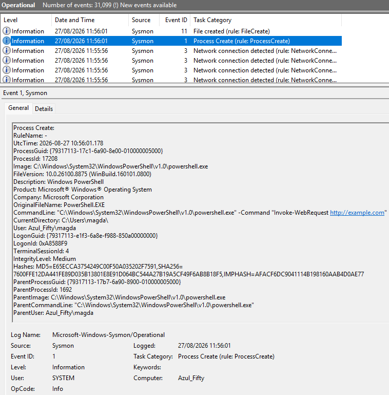
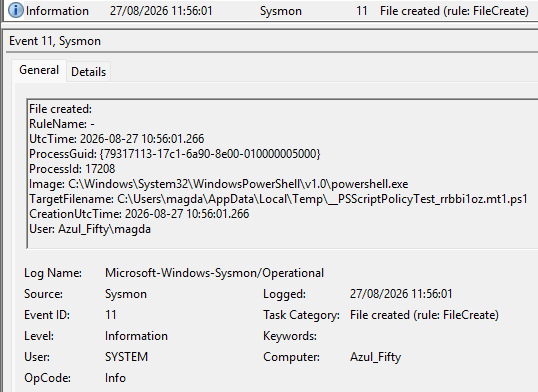
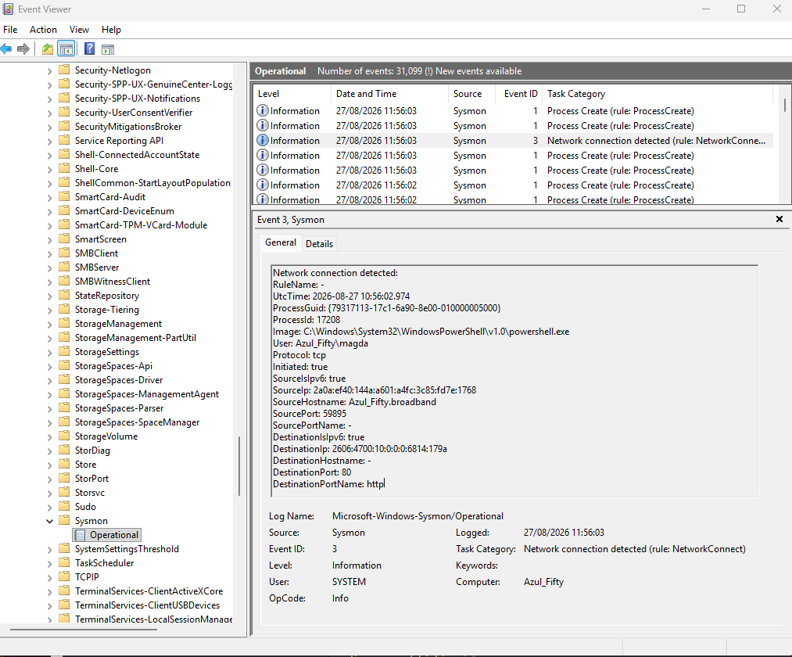
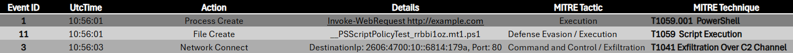

# Day 2 — Sysmon Suspicious Activity Analysis

## 🎯 Overview
This exercise focuses on correlating three Sysmon events generated by the same PowerShell process.  
The goal is to identify suspicious behaviour across **process creation**, **file creation**, and **network activity**, and map each event to **MITRE ATT&CK** tactics and techniques.

---

## 🧩 Common Process Information

All three events belong to the same process. These shared fields provide the context for the correlation:

| Field | Value |
|-------|--------|
| **ProcessId** | 17208 |
| **ProcessGuid** | {79317113-17c1-6a90-8e00-010000005000} |
| **Image** | powershell.exe |

---

## 📊 MITRE ATT&CK Correlation Table

This table summarises the three Sysmon events, their actions, and the corresponding MITRE ATT&CK mapping.

| Event ID | UtcTime | Action | Details | MITRE Tactic | MITRE Technique |
|----------|---------|--------|---------|--------------|------------------|
| **1** | 2026-08-27 10:56:01 | Process Create | Invoke-WebRequest http://example.com | **Execution** | **T1059.001 — PowerShell** |
| **11** | 2026-08-27 10:56:01 | File Create | __PSScriptPolicyTest_rrbbi1oz.mt1.ps1 | **Execution / Defence Evasion** | **T1059 — Script Execution** |
| **3** | 2026-08-27 10:56:02 | Network Connect | DestinationIp: 2606:4700:10::6814:179a, Port: 80 | **Command & Control / Exfiltration** | **T1041 — Exfiltration Over C2 Channel** |

---

## 🧠 SOC Interpretation

### **1️⃣ Process Create (Event ID 1)**
PowerShell is launched with a remote command:
`Invoke-WebRequest http://example.com`

This indicates **command execution** using PowerShell.  
Mapped to **MITRE T1059.001 — PowerShell**.

---

### **2️⃣ File Create (Event ID 11)**
A temporary PowerShell script is created:
`__PSScriptPolicyTest_rrbbi1oz.mt1.ps1`

This suggests **script execution** and potential **defence evasion**.  
Mapped to **MITRE T1059 — Script Execution**.

---

### **3️⃣ Network Connect (Event ID 3)**
PowerShell initiates an outbound HTTP connection:

DestinationIp: 2606:4700:10::6814:179a

Port: 80

This indicates possible **command and control** or **data exfiltration**.  
Mapped to **MITRE T1041 — Exfiltration Over C2 Channel**.

---

## 🖼 Visual Evidence

Screenshots of each Sysmon event and the correlation table are included in the `images/` directory.

### **Process Create (Event ID 1)**

### **File Create (Event ID 11)**

### **Network Connect (Event ID 3)**

### **Correlation Table**

---

## 📁 Files Included

- `images/` — screenshots of Sysmon events and the MITRE correlation table  
- `README.md` — documentation for Day 2

---

## 🏁 Conclusion

The three correlated Sysmon events reveal a clear suspicious activity chain:

1. **PowerShell execution**  
2. **Creation of a temporary script**  
3. **Outbound HTTP communication**

Mapping these behaviours to MITRE ATT&CK provides a structured understanding of the attacker’s potential objectives across **Execution**, **Defence Evasion**, and **Command & Control / Exfiltration**.

This analysis demonstrates practical SOC skills in event correlation, behavioural interpretation, and threat classification.

