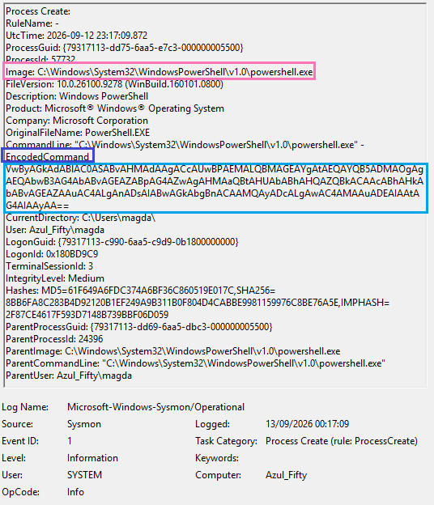

# Security Event Analysis
# PowerShell ScriptBlock Logging & De-obfuscation

## ◾ Summary
This analysis explores the critical role of **Event ID 4104 (PowerShell Script Block Logging)** in modern SOC operations. Threat actors heavily leverage Living-off-the-Land (LotL) techniques, frequently obfuscating PowerShell payloads using Base64 encoding to bypass static antivirus signatures and command-line logging. 

This case study demonstrates how to detect encoded executions and leverage advanced telemetry to reveal the true operational intent of the adversary.

---

## ◾  Attack Simulation (Red Team Perspective)
To generate the telemetry required for this analysis, a simulated threat actor execution was performed. A benign payload (a simple `Write-Host` message followed by a network `ping`) was converted into a Base64-encoded UTF-16LE string. 

This encoded payload was then passed directly to the execution engine using the `-EncodedCommand` parameter. This mirrors a common Living-off-the-Land (LotL) evasion technique utilised by adversaries to bypass standard command-line inspection and static antivirus signatures.

---

## ◾ Phase 1: Execution & Defence Evasion (The Encoded Command)

**Analysis:**
Adversaries rarely execute malicious scripts in plain text. In this simulated attack, the threat actor utilised the `-EncodedCommand` parameter. 

*   **Obfuscation Technique:** The payload was converted into a Base64 encoded UTF-16LE string. To a standard monitoring tool only watching command-line arguments (e.g., standard Event ID 4688 without ScriptBlock logging), the actual behaviour of the script remains completely invisible, appearing only as a random string of alphanumeric characters.

---

## ◾ Phase 2: De-obfuscation & Triage (Event ID 4104)

**Analysis:**
To counter this evasion tactic, robust endpoint visibility requires PowerShell Operational logging, specifically **Event ID 4104 (Execute a Remote Command / Script Block Logging)**.

*   **Dynamic Unpacking:** Regardless of the obfuscation method used at the command line, the PowerShell engine must decode the payload in memory to execute it. Event ID 4104 captures the script block *after* this decryption process.
*   **True Intent Revealed:** As highlighted in the telemetry, the logs successfully bypassed the Base64 obfuscation, exposing the raw, plain-text commands (`Write-Host` and network probing via `ping`). This allows the SOC analyst to perform accurate triage and extract valid Indicators of Compromise (IoCs).

---

## ◾ MITRE ATT&CK Mapping
This analysis directly maps to the following adversary behaviours:
*   **[T1059.001](https://attack.mitre.org/techniques/T1059/001/) Command and Scripting Interpreter: PowerShell**
*   **[T1140](https://attack.mitre.org/techniques/T1140/) Deobfuscate/Decode Files or Information** (From the perspective of the PowerShell engine processing the encoded payload).
*   **[T1027](https://attack.mitre.org/techniques/T1027/) Obfuscated Files or Information**

## ◾ Author
**Magda Dominguez**  
*SOC Analyst (L1-ready) Bristol, UK*  
Focused on Blue Team operations, detection engineering and log analysis.