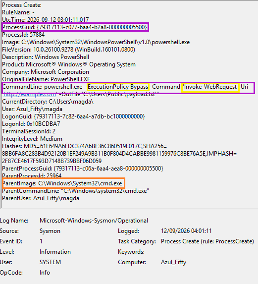
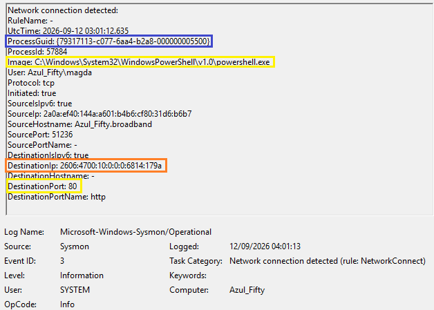
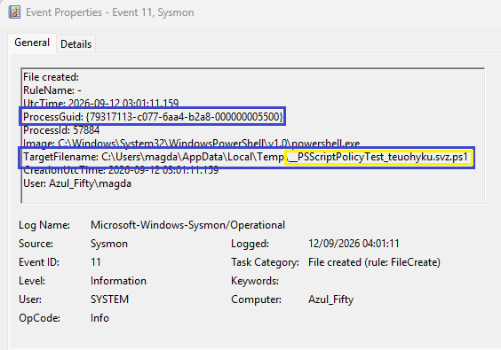

# Security Event Analysis
# Process Trees & Attack Chain Reconstruction 

## 🟪 Attack Simulation (Red Team Perspective)
To generate the telemetry for this investigation, a simulated fileless staging attack was executed via the command line, attempting to bypass local execution policies and download an external payload.

## 🟪 Summary
This analysis demonstrates the reconstruction of an endpoint attack chain using Sysmon telemetry. By pivoting on a single `ProcessGuid`, this case study tracks a suspicious PowerShell execution from its initial launch (Event ID 1), through its outbound network communication (Event ID 3), to the creation of local artefacts on disk (Event ID 11). 

Correlating these events allows SOC analysts to build a comprehensive timeline of adversary behaviour, eliminating blind spots between host execution and network staging.

---

## 🟪 Phase 1: Initial Execution & Evasion (Event ID 1)

**Analysis:**
The attack chain begins with **Event ID 1 (Process Creation)**, revealing a suspicious parent-child process relationship. The standard Windows command shell (`cmd.exe`) spawned `powershell.exe` with command-line arguments designed to subvert local security controls.

*   **Command Line:** The use of `-ExecutionPolicy Bypass` is a classic technique to override local endpoint restrictions before executing the `Invoke-WebRequest` cmdlet to download an external payload.
*   **ProcessGuid:** `{79317113-c077-6aa4-b2a8-000000005500}` was assigned to this specific PowerShell instance. This unique identifier serves as the primary pivot point for the rest of the investigation.

---

## 🟪 Phase 2: Command & Control / Staging (Event ID 3)

**Analysis:**
Following the execution, **Event ID 3 (Network Connection)** captured the outbound staging request. 

*   **Correlation:** Matching the `ProcessGuid` confirms that the exact PowerShell process identified in Phase 1 initiated this network traffic. 
*   **Network Artefacts:** The process established an outbound TCP connection over IPv6 to port 80 (HTTP). This aligns perfectly with the `Invoke-WebRequest` command attempting to reach the external domain (`http://example.com`) to retrieve the staged payload.

---

## 🟪 Phase 3: Artefact Creation on Disk (Event ID 11)

**Analysis:**
The final stage of this execution sequence was captured by **Event ID 11 (File Creation)**. 

*   **Engine Initialisation Indicator:** Rather than immediately dropping the intended `payload.txt`, Sysmon captured the creation of a temporary file: `__PSScriptPolicyTest_teuohyku.svz.ps1` within the user's `AppData\Local\Temp` directory.
*   **Forensic Significance:** This is a high-fidelity Indicator of Compromise (IoC). When PowerShell executes under certain conditions, it generates these temporary files to test if AppLocker or Constrained Language Mode (CLM) policies are actively enforced on the endpoint. Identifying this artefact provides crucial context that a script engine was invoked dynamically, a common precursor to fileless malware execution.

---

## 🟪 MITRE ATT&CK Mapping
This correlated execution chain maps directly to the following adversary techniques:
*   **[T1059.001](https://attack.mitre.org/techniques/T1059/001/) Command and Scripting Interpreter: PowerShell** (Initial execution and policy bypass).
*   **[T1105](https://attack.mitre.org/techniques/T1105/) Ingress Tool Transfer** (Attempting to download external payloads via `Invoke-WebRequest`).
*   **[T1071.001](https://attack.mitre.org/techniques/T1071/001/) Application Layer Protocol: Web Protocols** (Outbound HTTP staging).

## 🪪 Author
**Magda Dominguez**  
*SOC Analyst (L1-ready) Bristol, UK*  
Focused on Blue Team operations, detection engineering and log analysis.